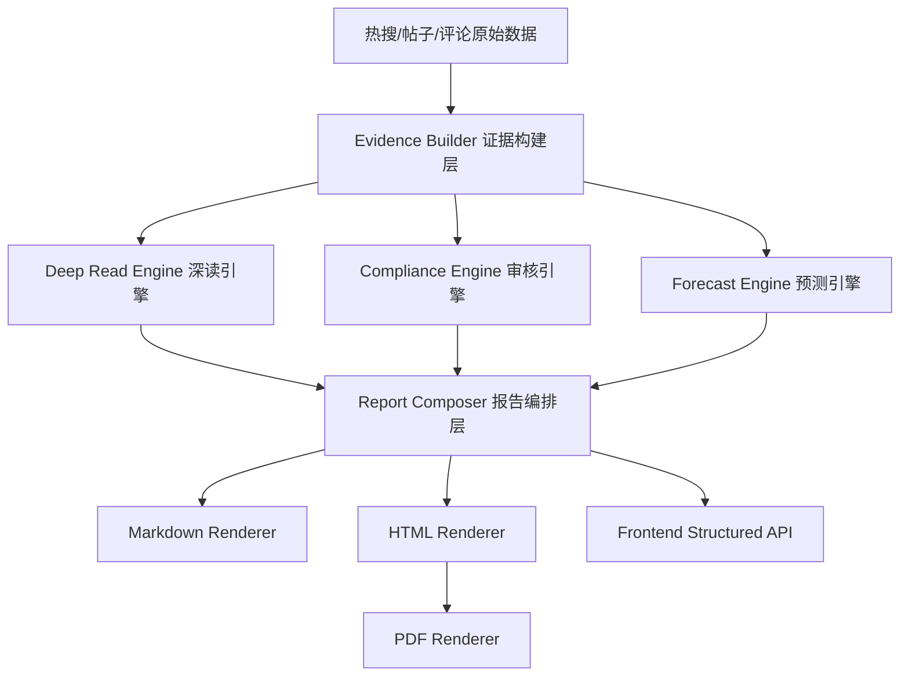
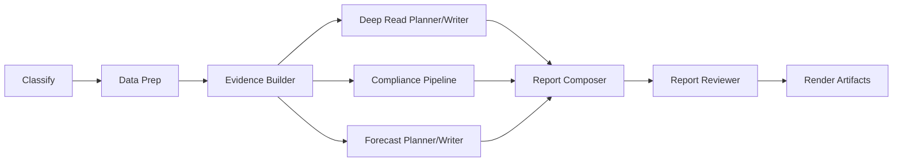

# 舆情报告系统深度重构设计文档

> 版本：v1.0  
> 日期：2026-04-01  
> 适用范围：`Backend` + `frontend` + 报告生成/违规审核/前端展示/下载导出链路  
> 文档定位：设计文档，不是实现清单

## 1. 文档目的

本文给出一套面向毕设答辩与后续落地的完整重构方案，目标不是“把几个 prompt 改顺”，而是把当前系统升级为一套真正具备以下特征的智能舆情分析平台：

- 能处理超出单次 LLM 上下文窗口的热搜、帖子、评论。
- 能生成兼具专业性、可读性、趣味性和传播力的舆情报告。
- 能对违规帖子与评论进行逐条、可解释、有法条依据的审核。
- 能尽量避免远程 LLM 内容安全过滤导致的大面积漏检。
- 能在前端优雅展示大批量违规结果和报告结构化内容。
- 能稳定导出并下载 `MD / HTML / PDF / JSON` 四类报告产物。
- 能在答辩时清晰说明系统架构演进、关键算法、工程难点与评价指标。

本文默认以下工程约束成立：

- 保留当前主框架：`FastAPI + LangGraph + Vue 3 + Pinia + MongoDB`。
- 允许中度重构，允许引入少量高价值依赖。
- 允许对现有 `B/C/D/E` Agent 拆分为更细的“规划-生成-校验-渲染”子流程。
- 当前目标优先是“正确、可展示、可答辩”，不是追求最小改动。

## 2. 当前系统的根因问题

当前系统不是单点缺陷，而是以下四类问题叠加：

### 2.1 信息组织方式错误

系统当前大量采用“全量内容拼接后直接丢给 LLM”的处理方式。  
问题不在于 LLM 不够聪明，而在于输入层没有做事件聚类、证据抽取、代表性切片、层级压缩，导致：

- 长文本超窗时只能粗暴截断。
- 深读和预测拿不到真正高价值证据。
- 前言只能复述表层热词，抓不住主轴。

### 2.2 输出目标设计错误

当前 Prompt 和 Schema 更像“规范公文生成器”，而不是“高级舆情编辑部”。  
它们过度强调：

- 固定段落结构。
- 最少句数。
- 严肃书面化语气。
- 通用治理建议。

结果是：

- 前言同质化。
- 深读标题不抓人。
- 预测部分像“公文续写”。
- 可读性和传播力明显偏弱。

### 2.3 违规审核的数据结构错误

当前审核结果的最核心问题不是展示样式，而是数据模型本身没有表达“逐条判定”的能力。  
系统现在更像是在输出“按帖子聚合的一份总体判决书”，而不是“对每一条帖子/评论做精确裁决”。

这会直接导致：

- 多条违规评论合并到一个单元格。
- 一个总体风险等级覆盖多条内容。
- 一个总体理由覆盖多条评论。
- 一个法条包覆盖所有评论。
- 前端再美化，也只能美化一个结构上已经错误的结果。

### 2.4 报告渲染与前端展示思路错误

当前报告的真实数据源是一个“大 Markdown 字符串”，不是结构化报告对象。  
因此：

- 前端只能把 Markdown 整页渲染出来。
- 长表格只能通过截断和弹窗补丁式处理。
- PDF 无法优雅导出。
- CSS 被硬塞进 Markdown 文件头，污染了内容层和渲染层。

## 3. 重构目标

本次重构的目标分为五层。

### 3.1 内容层目标

- 前言能一句话定调本期主矛盾。
- 重点深读拥有“标题有钩子、内容有判断、观点有记忆点”的表达能力。
- 趋势预测能提供真正的未来风险场景，而不是当前热点的重复改写。
- 报告语言同时满足“专业可信”和“用户愿意读”。

### 3.2 审核层目标

- 明确区分“正常负面情绪”与“可处罚违规表达”。
- 每条违规项必须具备：原文片段、精确 quote、类别、理由、法条、风险等级、处置建议、置信度。
- 未命中明确法条或证据链薄弱时，不直接判违规，应进入“疑似/待复核”。

### 3.3 工程层目标

- 支持大规模输入的层级压缩与证据索引。
- 报告生成过程可追踪、可审计、可解释。
- 渲染层与内容层解耦。
- MD/PDF/HTML 下载变为标准产物，而不是临时转换。

### 3.4 体验层目标

- 报告详情页从“大长文”升级为“结构化阅读界面”。
- 违规审核结果从“超长表格”升级为“按事件、按风险、按法条、按条目”的多视图展示。
- 用户能筛选、搜索、折叠、下载、定位原证据。

### 3.5 答辩层目标

- 系统架构有清晰演进逻辑。
- 每一项改造都能映射到明确问题。
- 有可量化的评价指标。
- 可以清楚解释“为什么这样设计，而不是只靠 prompt 调词”。

## 4. 备选方案对比

### 方案 A：仅修 Prompt 和少量渲染逻辑

思路：

- 改前言、深读、预测 Prompt。
- 微调 Markdown 拼装逻辑。
- 前端继续渲染 Markdown。

优点：

- 改动最小。
- 上手快。

缺点：

- 治标不治本。
- 长上下文、逐条审核、前端展示、PDF 导出这些核心问题不会被真正解决。
- 依然会被“输入粗糙 + 聚合错误 + Markdown 大字符串”拖住。

结论：

- 不推荐作为主方案。
- 只能作为过渡修补。

### 方案 B：基于结构化证据流的中度重构

思路：

- 把系统从“字符串驱动”改为“结构化证据对象驱动”。
- 保留 LangGraph 和现有主框架。
- 重构 B/C/D/E 的输入输出契约。
- 新增报告 JSON、渲染引擎、逐条审核模型、分层前端页面。

优点：

- 与当前代码库兼容性最好。
- 能完整解决内容质量、审核颗粒度、导出和展示问题。
- 技术深度和工程合理性都足够支撑毕设答辩。

缺点：

- 需要重构部分 schema、state、report renderer、前端报告页。

结论：

- 推荐作为主方案。

### 方案 C：重服务化 + 多模型 API + 专用检索服务

思路：

- 新增独立 moderation service、retrieval service、render service。
- 引入多模型 API 分流、外部 rerank 服务或 API 分类器、专用向量库。

优点：

- 上限最高。
- 可扩展性最强。

缺点：

- 工程复杂度明显上升。
- 毕设阶段实现风险高。
- 交付周期长。

结论：

- 可作为长期演进方向。
- 不建议直接作为本轮落地主线。

## 5. 推荐总体方案

推荐采用 **方案 B：结构化证据流中度重构**，并为后续向方案 C 演进预留接口。

### 5.1 总体架构原则

- `ReportDocument JSON` 作为唯一权威报告对象。
- `EvidencePack` 作为分析与审核的统一输入层。
- `逐条审核` 代替 `按帖子整体判决`。
- `HTML 渲染` 代替 `Markdown+内嵌 CSS` 作为展示和 PDF 的主路线。
- `Markdown` 退化为归档与轻量导出格式，不再承担版式渲染职责。
- `两阶段审核 + 法条 RAG + 不确定性复核` 代替“全量丢给远程 LLM 决定一切”。

### 5.2 目标系统分层



### 5.3 推荐目录形态

建议将当前后端拆出以下逻辑边界：

```text
Backend/app/
  analysis/
    evidence_builder.py
    clustering.py
    summarization.py
    style_controller.py
    title_editor.py
  audit/
    candidate_recall.py
    item_judge.py
    policy_rag.py
    aggregation.py
    confidence.py
  forecast/
    signal_collector.py
    scenario_planner.py
    risk_coupling.py
    reviewer.py
  reporting/
    models.py
    composer.py
    renderers/
      markdown_renderer.py
      html_renderer.py
      pdf_renderer.py
    templates/
      base.html
      report.html
      partials/
  evaluation/
    report_eval.py
    audit_eval.py
```

前端建议拆出：

```text
frontend/src/features/report/
  components/
    ReportSummaryCards.vue
    DeepReadSection.vue
    ForecastSection.vue
    ViolationOverview.vue
    ViolationCaseList.vue
    ViolationCaseDrawer.vue
    EvidenceQuote.vue
  composables/
    useReportDetail.ts
    useViolationFilters.ts
  views/
    ReportDetailStructured.vue
```

## 6. 核心数据契约重构

当前系统最大的问题之一，是状态对象和 schema 不支持“证据-结论-展示”的逐层映射。  
因此必须先重构数据契约。

### 6.1 新增 `EvidencePack`

作用：

- 作为所有 Agent 的统一输入。
- 解决长上下文整合与证据可追踪问题。

建议结构：

```text
EvidencePack
  event_id
  event_name
  event_heat
  topic_tags
  official_facts[]
  post_clusters[]
  sentiment_distribution
  risk_candidates[]
  representative_quotes[]
  evidence_registry[]
```

其中 `evidence_registry` 每条记录都保留：

- `evidence_id`
- `source_type`：热搜 / 帖子 / 评论 / 联网搜索 / 官方通报
- `raw_text`
- `normalized_text`
- `speaker_role`
- `timestamp`
- `cluster_id`
- `token_len`

### 6.2 新增 `ReportDocument`

所有报告最终都先生成结构化 JSON，再渲染为 Markdown / HTML / PDF。

建议结构：

```text
ReportDocument
  meta
  executive_summary
  overview_table
  deep_reads[]
  forecasts[]
  compliance_summary
  compliance_cases[]
  appendix
  artifacts
```

### 6.3 重构违规结果数据模型

建议把当前“按帖子总体判决”改成“按单条内容裁决”：

```text
ViolationCase
  case_id
  event_id
  source_type           # post/comment
  source_id
  parent_post_id
  raw_text
  highlighted_quote
  target_entity
  violation_category
  matched_law
  reasoning
  disposal_suggestion
  risk_level
  confidence
  judge_engine
  evidence_ids[]
  needs_manual_review
```

### 6.4 保留 `ViolationCluster`

逐条判定不等于前端必须逐条平铺。  
展示层应在逐条判定之上，再增加“相似项聚类”：

```text
ViolationCluster
  cluster_id
  event_id
  category
  law_article
  case_ids[]
  representative_case_id
  count
```

这样系统就能同时满足：

- 审核上逐条精确。
- 展示上聚合优雅。

## 7. 超长上下文处理方案

这是本次重构必须重点解决的问题。

### 7.1 基本原则

不能再使用“全量拼接 -> 超窗 -> 截断”的策略。  
必须改为“先结构化，再压缩，再生成”。

### 7.2 分层压缩链路

建议采用四层压缩：

1. 原始层：热搜、帖子、评论、搜索资料原文。
2. 切片层：按事件、帖子、评论簇切成独立证据单元。
3. 摘要层：对每个帖子簇、观点簇、风险簇做局部摘要。
4. 写作层：只把局部摘要、统计量、代表性证据、证据 ID 喂给写作 Agent。

### 7.3 事件级聚类

每个热点事件需要先做：

- 热搜词去重与别名归并。
- 帖子主题聚类。
- 评论立场聚类。
- 风险候选聚类。

建议使用：

- 词法规则 + embedding 相似度的双重聚类。
- 每个 cluster 输出：主题标签、代表性帖子、代表性评论、数量、情绪分布、极端样本、转折样本。

### 7.4 代表性样本选取原则

不要再按“前 N 条评论”截断。  
每个聚类至少选取下列样本：

- 热度最高样本。
- 立场最典型样本。
- 情绪最激烈样本。
- 信息量最大样本。
- 可能代表谣言扩散的样本。
- 与主流观点对立的样本。

### 7.5 Token 预算管理

建议新增 `TokenBudgetManager`：

- 为前言、深读、预测、审核分别设预算。
- 优先保留“高价值证据 + 统计锚点 + 代表性引用”。
- 次要内容进入附录或聚类摘要，不直接进入写作主上下文。

### 7.6 可选的压缩增强

对于特别长的事件，可引入文档压缩链：

- `ContextualCompressionRetriever`
- `LLMLingua` 风格的文档压缩
- Parent-child 文档检索

其价值在于：

- 保留相关段落。
- 降低写作阶段上下文噪音。
- 减少“超窗后只能粗暴删减”的现象。

## 8. 深读引擎重构方案

重点舆情深读必须从“报告作文”升级为“编辑部深读”。

### 8.1 新的深读生成链

建议把当前 Agent B 拆成四步：

1. `DeepRead Planner`
   - 判断这个事件最值得写的角度是什么。
   - 输出“主问题、冲突点、值得命名的标题方向”。

2. `Evidence Reducer`
   - 将帖子簇、评论簇、联网搜索结果压缩为可写作证据包。

3. `DeepRead Writer`
   - 输出深读标题、导语、一句话判断、事件脉络、舆论画像、深度解读。

4. `Style Reviewer`
   - 检查是否空泛、是否复述、是否有钩子、是否太像公文。

### 8.2 标题策略

深读标题不应再直接使用热搜原词。  
建议每个深读 section 同时生成：

- `raw_event_title`：原始事件名
- `editorial_title`：编辑化标题
- `one_line_verdict`：一句话判断

例如：

- 原始标题：`国家线 砍一刀`
- 编辑标题：`国家线还没出，焦虑已经先冲上热搜`
- 一句话判断：`这不是单一分数线争论，而是升学竞争预期失衡的一次集中爆发`

### 8.3 深读正文结构

建议每个深读统一为六块：

1. `导语`
2. `事件脉络`
3. `网友在吵什么`
4. `真正的矛盾是什么`
5. `为什么这件事会炸`
6. `这件事会留下什么后效`

这比当前“概述-观点-深度研判”更适合读者阅读，也更适合答辩展示“用户导向设计”。

### 8.4 风格控制机制

建议引入双层风格控制：

- 专业层：不编造、不煽情、不低俗、结论可追溯。
- 可读层：标题有钩子、开头有判断、正文有场景、有对比、有锋芒。

这里的目标不是写低质量“标题党”，而是：

- 标题更抓人。
- 正文更锋利。
- 论证仍然严谨。

## 9. 趋势预测引擎重构方案

当前预测的核心缺陷不是“语言不够好”，而是“没有构造真正的未来场景”。

### 9.1 预测链必须从“续写当前热点”改为“构造未来风险场景”

新的预测链建议拆为：

1. `Future Signal Collector`
2. `Risk Coupling Planner`
3. `Scenario Writer`
4. `Forecast Reviewer`

### 9.2 未来信号来源

必须显式采集两类信号：

- 历史同期规律：
  - 往年同月热议点
  - 领域周期性节点
  - 历史高发争议模式

- 未来确定性事件：
  - 政策节点
  - 考试日程
  - 节日与纪念日
  - 行业发布会
  - 季节性民生议题

### 9.3 预测点的最小内容标准

每一个预测点必须包含：

- `触发时间`
- `触发事件`
- `重点人群`
- `线上发酵场景`
- `线下现实场景`
- `可能争议点`
- `扩散路径`
- `应对建议`
- `证据来源`
- `发生概率`

### 9.4 预测不再只写一个点

每个 Topic 必须至少有 `2-4` 个子风险点，分别覆盖：

- 主风险
- 次级衍生风险
- 舆情放大器
- 治理难点

### 9.5 预测表达风格

建议在保持专业性的前提下增加：

- 场景化表达
- 具体角色视角
- 日常生活锚点
- 锋利但不浮夸的判断句

例如不是只写：

- “信息透明度不足将引发焦虑”

而是改写成：

- “当查分时间表迟迟不落地，最先失控的不是数据，而是评论区里‘到底什么时候出’的连锁猜测”

### 9.6 预测质量门控重写

预测质量门控必须新增检查：

- 每个 topic 是否有足够子点。
- 每个点是否包含时间、场景、群体、路径、证据。
- 是否只是当前热点的改写。
- 是否具备未来性而不是回顾性。
- 是否具备可读性而不是套话。

## 10. 违规审核引擎重构方案

这是本次重构中最关键的一块。

### 10.1 审核原则

必须明确以下原则：

- 负面情绪不等于违规。
- 对事件表达愤怒不等于人身攻击。
- 指责、批评、抱怨、质疑不应默认归入违规。
- 只有在明确命中平台规则或法律规范时，才进入违规。
- 证据不足时，应进入“疑似/待复核”，不能强判。

### 10.2 新的审核流水线

建议改为四阶段。

#### 阶段 1：候选召回

目标：

- 不让主审查 LLM 直接面对整篇高毒内容。
- 先用本地规则和轻量 API 分类链做候选筛选。

召回对象：

- 明确辱骂
- 明确人身攻击
- 明确威胁/煽动暴力
- 明确仇恨歧视
- 明确造谣型陈述
- 明确淫秽/未成年人侵害表述
- 明确煽动网暴/人肉

可用方法：

- 规则词典 + 模式匹配
- `Aho-Corasick` 词表匹配
- 分句级风险打分
- 轻量 API 分类器

这里的“轻量 API 分类器”不是再走一遍完整写作式大模型，而是调用成本更低、上下文更短的 API 节点做：

- `suspect / non_suspect` 二分类
- `candidate_labels` 多标签初筛
- `needs_review` 标记

也就是说，系统即使完全不能部署本地模型，也仍然可以通过“本地规则 + 小模型 API 分流 + 大模型 API 精判”的方式实现分层审核。

设计要点：

- 召回阶段只负责“找嫌疑项”，不负责最终定罪。

#### 阶段 2：逐条法理判定

对候选项逐条判定，而不是按帖子整体判定。

LLM 输入只包含：

- 单条内容原文
- 最小必要上下文
- 明确的审核规则
- 必须输出精确 quote 和理由

必须禁止：

- “潜在影响很严重，所以算违规”这类泛化理由。
- “可能造成……”式空洞裁决。

必须要求：

- 逐字对齐 quote
- 明确指出对象是谁
- 明确指出行为是什么
- 明确说明为什么违反哪类规则

#### 阶段 3：法条 RAG

目标：

- 给每条候选命中最贴合的条款，而不是给整组内容塞一包法条。

每条 `ViolationCase` 单独检索：

- `query = 类别 + 关键行为 + target + quote + reasoning`

并要求返回：

- 主命中条款
- 备选条款
- 适配分数
- 风险等级

#### 阶段 4：聚合展示与人工复核

审核结果分为三类：

- `confirmed_violation`
- `suspected_violation`
- `non_violation`

其中 `suspected_violation` 进入人工复核列表，不能直接并入正式违规案例。

### 10.3 远程 LLM 安全过滤控制策略

要尽量降低被远程 LLM 安全过滤，不应继续走“不断加大脱敏和替换力度”的路线。  
正确做法是 **改变审核架构**，而不是继续做“反过滤技巧工程”。

在“只能使用 LLM API、不能本地部署模型”的约束下，推荐策略如下：

1. 主审查模型不接触全量评论池，只接触候选项。
2. 每次只输入单条或小批量候选项。
3. 提供最小必要上下文，而不是整段高毒讨论。
4. 极端高风险文本先经过本地规则预筛，再交给轻量 API 分类器做二次分流。
5. 将“候选召回”“违规裁决”“法条解释”拆给不同 API 节点，不让一个模型同时处理最脏内容和最复杂推理。
6. 对可能触发安全策略的内容，原文保留在数据库中，但传给主裁决模型的是最小裁决单元。
7. 对超高风险文本采用“先标签、后理由、再法条”的链式调用，而不是一次性要求模型完成全部任务。

推荐的 API 审核链如下：

```text
全量评论
  -> 本地规则召回
  -> 轻量 API 分类器（疑似/类别初筛）
  -> 主裁决 API（逐条是否违规 + quote + reasoning）
  -> 法条 RAG
  -> 法条解释 API / 处置建议 API
```

这条路线的本质是：

- 不是绕过安全策略。
- 而是通过“缩小单次输入粒度 + 拆分任务 + 分层 API 调用”减少主裁决模型暴露在大规模高毒原文中的频率。

### 10.4 审核边界矩阵

建议新增一份“审核边界矩阵”，作为系统规则基座。

示例：

| 表达类型 | 是否默认违规 | 说明 |
| :--- | :---: | :--- |
| 单纯表达愤怒、不满、失望 | 否 | 正常舆论情绪 |
| 针对行为的强烈批评 | 否 | 属于批评性表达 |
| 明确侮辱个体或群体 | 是 | 人身攻击 |
| 呼吁暴力、报复、死亡 | 是 | 煽动暴力/公共秩序风险 |
| 无证据断言具体事实并传播 | 视情况 | 涉谣言/不实信息 |
| 粗口但无明确攻击对象 | 低优先级 | 可作为情绪，不直接违规 |

该矩阵应成为：

- Prompt 的上位规则
- 审核评测集的标注准则
- 人工复核页面的判定参考

## 11. 法条 RAG 重构方案

当前 RAG 的问题不是“没有向量库”，而是“检索对象、检索 query、结果重排、条款粒度”都不够精细。

### 11.1 条款库重建方式

法规/公约知识库不应只按整条规则粗存。  
建议将每条规则拆成结构化条款单元：

```text
PolicyChunk
  chunk_id
  source
  article
  category
  prohibited_action
  target_type
  rule_text
  short_desc
  risk_level
  keywords[]
  examples[]
```

### 11.2 检索策略重构

推荐采用 `Hybrid Retrieval + Metadata Filter + Rerank`：

1. 词法召回：BM25 / sparse
2. 语义召回：dense embedding
3. 元数据过滤：按 `category / risk_level / target_type`
4. rerank：对前 N 条结果做精排

### 11.3 向量库选型建议

短期兼容方案：

- 保留 Chroma 以减少迁移成本。
- 外挂一层 BM25 词法索引和 rerank 逻辑。

推荐目标方案：

- 检索抽象层统一接口。
- 后续优先迁移到 Qdrant。

原因：

- 更强的 payload/filter 能力。
- 支持更成熟的 hybrid 检索思路。
- 更适合法规/标签/条款编号等结构化 metadata 过滤。

### 11.4 检索结果质量约束

法条检索必须满足：

- 每条违规项至少返回 1 条主命中条款。
- 主命中条款与 quote 的行为类型一致。
- 未通过置信阈值时，不直接写入最终报告，进入“低置信度”或“待复核”。

### 11.5 不再使用“整组内容共用一包法条”

这是当前系统必须彻底废弃的设计。  
法条必须按 `ViolationCase` 粒度命中，而不是按帖子聚合命中。

## 12. 报告组装与导出方案

### 12.1 总体思路

当前系统的核心错误是把 Markdown 当成主产物。  
重构后应改为：

```text
ReportDocument JSON -> HTML -> PDF
                    -> Markdown
                    -> Frontend Structured API
```

也就是说：

- 结构化 JSON 才是主产物。
- HTML 是主展示与主导出载体。
- PDF 是 HTML 的打印结果。
- Markdown 只是文本归档与轻量共享格式。

### 12.2 为什么不能继续把 CSS 塞进 Markdown

原因很简单：

- Markdown 是内容层，不是版式层。
- CSS 写进 Markdown 会污染报告列表标题解析。
- 前端还要先删 `<style>` 才能渲染。
- PDF 导出时依然难以稳定控制分页、页眉页脚、目录、图表。

### 12.3 推荐的报告渲染链

建议采用：

- `Jinja2`：HTML 模板渲染
- `Playwright`：主 PDF 渲染引擎
- `WeasyPrint`：服务端回退 PDF 引擎

### 12.4 工具选型对比

| 工具 | 定位 | 优点 | 缺点 | 结论 |
| :--- | :--- | :--- | :--- | :--- |
| `xhtml2pdf` | 旧 HTML->PDF | 已在项目中出现过 | 中文和现代 CSS 能力弱，版式上限低 | 不再作为主线 |
| `WeasyPrint` | HTML/CSS -> PDF | 纯 Python、适合分页文档、印刷特性好 | 某些现代 CSS/JS 能力不如 Chromium | 作为后端回退很优秀 |
| `Playwright page.pdf()` | Chromium 打印 PDF | 现代 CSS 兼容好、与浏览器效果一致、适合复杂样式 | 需要浏览器运行时 | 作为主 PDF 引擎最推荐 |
| `ReportLab` | 低层 PDF 绘制 | 控制最强 | 开发成本高、排版工作量大 | 不适合作为毕业设计主线 |

### 12.5 推荐渲染架构

建议建立渲染接口：

```text
Renderer
  -> MarkdownRenderer
  -> HtmlRenderer
  -> PdfRenderer
       -> PlaywrightPdfRenderer
       -> WeasyPrintPdfRenderer
```

### 12.6 PDF 生成建议

主路线：

- `Jinja2` 生成 HTML 报告。
- `Playwright page.pdf()` 生成 PDF。

回退路线：

- `WeasyPrint HTML.write_pdf()` 作为后备。

### 12.7 下载产物设计

每次报告生成后，缓存：

- `report.json`
- `report.md`
- `report.html`
- `report.pdf`

前端下载按钮支持：

- 下载 Markdown
- 下载 PDF
- 下载原始 JSON（答辩/调试）

API 设计建议：

- `GET /api/reports/{report_id}`
- `GET /api/reports/{report_id}/artifact?format=json`
- `GET /api/reports/{report_id}/artifact?format=md`
- `GET /api/reports/{report_id}/artifact?format=html`
- `GET /api/reports/{report_id}/artifact?format=pdf`

## 13. 前端展示重构方案

### 13.1 报告详情页不再直接渲染大 Markdown

建议新增结构化报告页面，而不是继续以 `v-html + marked` 为主。

推荐布局：

1. 顶部：
   - 报告标题
   - 研判周期
   - 分类标签
   - 下载按钮

2. 左侧目录锚点：
   - 总结
   - 热点总览
   - 重点深读
   - 趋势预警
   - 违规审核
   - 附录

3. 正文区：
   - 卡片化 sections

### 13.2 违规审核结果的最佳展示方式

不建议继续用“全量大表格”为主。  
推荐采用“概览 + 分组列表 + 详情抽屉”的三层结构。

#### 第一层：概览区

- 高/中/低风险数量卡片
- 违规类别分布图
- 事件分布图
- 待复核数量

#### 第二层：事件分组区

按事件折叠展示：

- 事件名
- 风险等级
- 违规总数
- 主要类别标签

每个事件可以展开查看该事件下的违规簇。

#### 第三层：逐条案例区

每条 `ViolationCase` 以卡片形式展示：

- 原文摘要
- 高亮违规片段
- 类别标签
- 法条标签
- 理由
- 建议处置
- 风险等级
- 置信度
- 原始上下文入口

### 13.3 相似项聚类展示

对高重复评论不应全部平铺。  
应展示为：

- 代表性案例卡
- “相似表达共 37 条”
- 点击展开查看同类评论列表

### 13.4 报告页面视觉策略

本次重构不再让 Markdown 表格承担复杂展示职责。  
建议使用：

- 信息卡片
- 标签 chips
- 折叠面板
- 侧边抽屉
- 证据引用块
- 风险时间线

这样既适合阅读，也适合答辩时投屏演示。

## 14. Prompt 体系重构方案

Prompt 不应再是一整块“超级模板”。  
应拆成可控子任务。

### 14.1 Prompt 组织原则

- `planner`：决定写什么
- `writer`：负责成文
- `reviewer`：负责挑错
- `schema`：约束结构

### 14.2 写作 Prompt 的新要求

对于前言、深读、预测，要新增以下控制维度：

- 必须先给判断，再展开解释。
- 必须绑定具体事件簇和具体证据。
- 必须避免“宏大空泛三件套”。
- 必须具备“可读性审查”。
- 必须区分“标题风格”和“正文风格”。

### 14.3 风格层建议

建议引入统一 `StyleController`：

- `tone = 专业`
- `sharpness = 高`
- `verbosity = 中`
- `hook_strength = 中高`
- `ban = 套话、公文空话、机械三段论`

### 14.4 新增写后审查 Prompt

对每一段正文增加二次评审：

- 有没有先说判断。
- 有没有说人话。
- 有没有场景。
- 有没有具体证据。
- 有没有重复空话。
- 有没有强行上价值。

## 15. LangGraph 工作流重构方案

建议从当前单层 B/C/D/E 结构，升级为“证据构建 + 专业节点 + 渲染节点”。

### 15.1 新工作流建议



### 15.2 关键改动

- 把 `Evidence Builder` 设为所有分析节点的上游。
- 把 `Report Composer` 与 `Renderer` 解耦。
- 把 `Reviewer` 从质量门控中升级为真正的内容审校节点。

### 15.3 质量门控不再只看“生成出来了没有”

新的质量门控指标建议包含：

- 证据锚定率
- 主轴明确率
- 重复句率
- 套话密度
- 每个预测点的场景完整度
- 审核案例的一一映射完整度
- PDF/HTML/MD 一致性

## 16. 评测与答辩指标设计

为了让系统能过答辩，必须有清晰的量化评价。

### 16.1 报告质量指标

- `Summary Thesis Accuracy`：前言主判断与人工结论一致率
- `Deep Read Novelty Score`：深读非复述率
- `Forecast Completeness`：预测点完整度
- `Readability Score`：用户打分或规则评分
- `Evidence Grounding Rate`：正文是否能回溯证据 ID

### 16.2 审核质量指标

- `Violation Precision`
- `Violation Recall`
- `Law Match Accuracy`
- `False Positive Rate on Negative Emotion`
- `Content Filter Hit Rate`
- `Manual Review Rate`

其中最重要的是：

- “普通负面情绪误判为违规”的比例必须显著下降。

### 16.3 系统工程指标

- 单份报告生成时延
- PDF 生成时延
- 超长输入压缩后保留率
- 报告 artifact 命中缓存率
- 前端首屏渲染时延

### 16.4 建议建立小型标注集

毕设答辩时非常加分的一件事，是构建一个小型评测集：

- 100-300 条审核样本
- 20-30 份热点事件深读样本
- 若干预测任务样本

用来对比：

- 原系统
- 重构系统

这样答辩时就不是“我觉得优化了”，而是“我验证了优化有效”。

## 17. 推荐落地顺序

虽然本文不是实现计划，但从设计合理性上，建议按以下顺序推进。

### 第一阶段：先修数据契约

- 引入 `EvidencePack`
- 引入 `ReportDocument`
- 引入逐条 `ViolationCase`

### 第二阶段：重构违规审核链

- 先解决误判和一一对应
- 再解决展示

原因：

- 审核链是目前最影响可信度的模块。

### 第三阶段：重构深读与预测

- 前言
- 深读
- 趋势预测

### 第四阶段：重构报告渲染与导出

- JSON -> HTML -> PDF/MD

### 第五阶段：前端结构化展示升级

- 先支持新 API
- 再替换旧 Markdown 页面

## 18. 关键设计结论

本次重构最重要的结论有八条：

1. 不能再把 Markdown 字符串当作报告真身，必须建立 `ReportDocument JSON`。
2. 不能再把全量热搜/帖子/评论直接拼接给 LLM，必须建立 `EvidencePack` 和分层压缩链。
3. 不能再按帖子整体做违规判决，必须按条目判定，再按相似项聚类展示。
4. 不能再依赖“更多脱敏和替换”来对抗 LLM 过滤，必须改为“本地规则候选召回 + API 分层调用 + 远程最小裁决单元”。
5. 不能再用一份大 prompt 同时完成规划、写作、审查，必须拆为 planner/writer/reviewer。
6. 不能再让预测只写一个点，必须显式构造未来场景和多点风险链。
7. 不能再让前端渲染大长表，必须用结构化卡片、分组和抽屉承载审核结果。
8. 不能再把 `xhtml2pdf` 当主方案，推荐 `Jinja2 + Playwright PDF`，`WeasyPrint` 作为服务端回退。

## 19. 工具与资料参考

以下资料可作为本设计的官方参考依据：

- LangChain Retrieval 官方文档：  
  `https://docs.langchain.com/oss/python/langchain/retrieval`

- LangChain Retrievers 官方索引：  
  `https://docs.langchain.com/oss/python/integrations/retrievers/index`

- LangChain Contextual Compression / Rerank 相关文档：  
  `https://docs.langchain.com/oss/python/integrations/retrievers/cohere-reranker/`

- LangChain LLMLingua 文档压缩文档：  
  `https://docs.langchain.com/oss/python/integrations/retrievers/llmlingua/`

- Qdrant Payload / Filtering / Hybrid Queries 官方文档：  
  `https://qdrant.tech/documentation/concepts/payload/`  
  `https://qdrant.tech/documentation/concepts/filtering/`  
  `https://qdrant.tech/documentation/concepts/hybrid-queries/`

- Qdrant Hybrid Search with Reranking 官方教程：  
  `https://qdrant.tech/documentation/advanced-tutorials/reranking-hybrid-search/`

- Playwright `page.pdf()` 官方文档：  
  `https://playwright.dev/python/docs/api/class-page#page-pdf`

- Playwright Downloads 官方文档：  
  `https://playwright.dev/docs/downloads`

- WeasyPrint 官方文档：  
  `https://doc.courtbouillon.org/weasyprint/`

- WeasyPrint First Steps / `write_pdf()` 文档：  
  `https://doc.courtbouillon.org/weasyprint/v68.0/first_steps.html`

- Jinja 模板继承官方文档：  
  `https://jinja.palletsprojects.com/en/stable/templates/`

## 20. 最终推荐

如果只允许一句话概括本次重构路线，建议定义为：

**把当前“字符串拼接型舆情系统”升级为“结构化证据驱动、逐条可解释审核、HTML 主渲染、多产物导出、面向用户阅读体验”的智能舆情分析平台。**

这条路线同时具备：

- 工程合理性
- 算法解释力
- 用户体验提升空间
- 毕设答辩可讲性
- 后续继续扩展的架构余量

它不是简单改 prompt，而是把“数据、推理、审核、渲染、展示”五层重新校正到正确方向上。
