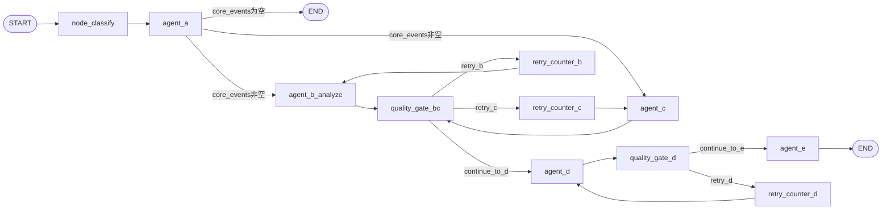
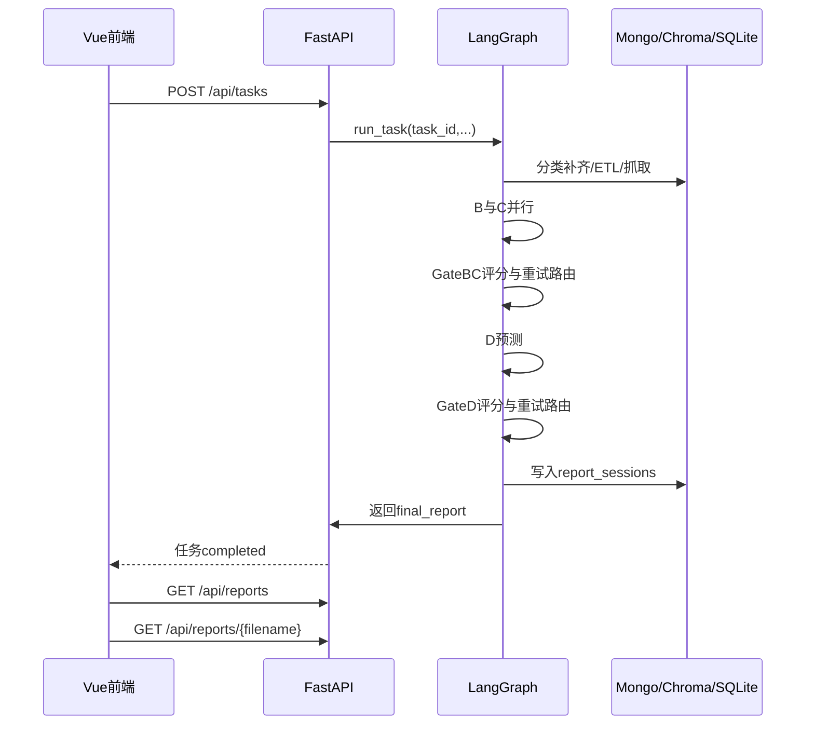

# 社交网络内容安全审核与报告生成系统代码级详细设计

---

## 2. 与概要设计承接映射

| 概要设计模块 | 代码级实现节点/服务 | 关键文件 |
|---|---|---|
| 数据采集与预处理 | node_classify + agent_a + event_merger | Backend/app/agents/nodes.py, Backend/app/etl/event_manager.py |
| 舆情观点分析 | agent_b_analyze + Map/Reduce | Backend/app/agents/nodes.py, Backend/app/services/opinions.py |
| 合规审查与违规检测 | agent_c + Batch审查 + RAG/HyDE | Backend/app/agents/nodes.py, Backend/app/services/compliance.py |
| 趋势预测与风险研判 | agent_d + ReAct + Tavily | Backend/app/agents/nodes.py, Backend/app/services/forecast.py |
| 智能报告生成 | agent_e + report_sessions落库 + md输出 | Backend/app/agents/nodes.py, Backend/app/services/report.py |
| 人机交互与可视化 | FastAPI任务编排 + Vue路由/API | Backend/app/api/main.py, frontend/src/router/index.js, frontend/src/api/index.js |

---

## 3. 系统执行主链（真实工作流）



关键事实：
1. B和C并行。
2. 存在两级质量门控（BC合流后一次，D后一次）。
3. 重试由`retry_counter_*`节点驱动，质量门控只负责路由判定。
4. 编译时不在`workflow.py`内完成，运行时由`main.py`注入SQLite checkpointer。

---

## 4. GraphState字段级契约

### 4.1 输入初始化字段（run_task注入）

| 字段 | 类型 | 说明 |
|---|---|---|
| task_id | str | 任务ID，同时作为线程会话标识 |
| start_date/end_date | str\|None | 时间窗口，缺失时内部回退近24小时 |
| category | str\|None | 综合/社会/高校/生活/科技/政治/其他 |
| forecast_range | str\|None | 1w/2w/1m/2m |
| retry_count | dict | 各节点重试计数 |

### 4.2 中间产物字段

| 字段 | 生产者 | 消费者 | 结构要点 |
|---|---|---|---|
| core_events | agent_a | B/C/E | 事件列表，前20项附`_fetched_posts` |
| analyzed_events | agent_b_analyze | D/E/GateBC | 每事件含`opinion_report` |
| audit_results | agent_c | D/E/GateBC | 仅违规项，含原帖与违规评论原文 |
| trend_forecast | agent_d | E/GateD | `target_period` + `topics[]` |
| final_report | agent_e | API返回/文件系统 | 完整Markdown字符串 |
| violation_stats | agent_e | dashboard接口 | 类别分布快照 |

### 4.3 控制字段

| 字段 | 说明 |
|---|---|
| current_step | 运行阶段标识（如A_Done、B_Done） |
| supervisor_feedback | 质量门控反馈，供B/C/D重试提示词注入 |
| quality_scores | 评分对象，含B/C/D分数与反馈 |
| error | 异常兜底标记（按节点返回） |

---

## 5. 节点级实现细节

## 5.1 node_classify（分类补齐）

输入：`category/start_date/end_date`。

处理规则：
1. `category`为空或`综合`，直接跳过并返回`Classify_Skipped`。
2. 时间缺失时默认近24小时。
3. 从`hot_trends_history`读词条，提取去重词集合。
4. 读取已有分类映射，避免覆盖旧分类。
5. 并行分类（`max_workers=8`）后回写`top_n[].category`。

输出：
- `current_step`取值之一：`Classify_Done/Classify_Skipped/Classify_Empty/Classify_Error`。

异常路径：
- 分类失败不抛出中断，返回`Classify_Error`并让后续按当前数据继续。

---

## 5.2 agent_a（数据准备总控）

固定参数：
1. `FETCH_EVENT_COUNT=20`
2. `POSTS_PER_EVENT=15`
3. `COMMENTS_PER_POST=200`

三阶段：
1. ETL归并：`event_merger.run_merge_task(start,end,category)`。
2. 选题：`agent_stats.run(top_n=50)`得到`core_events`。
3. 数据扩展：仅前20事件并发抓取帖子和评论，并注入`_fetched_posts`。

`_fetched_posts`单贴结构：
- `note_id`
- `db_id`
- `content`
- `comments`（纯文本数组）
- `comment_items`（含评论db_id和文本）
- `media_context`（图片链接+视频链接拼接）
- `audit_status/is_violation/violation_info`

关键清洗：
1. `_id/id`强制字符串化，避免JSON序列化异常。
2. 事件抓取失败不致命，写日志并继续其他事件。

终止条件：
- 若ETL空或选题空，`core_events=[]`，由`should_continue`直接结束流程。

---

## 5.3 agent_b_analyze（深度观点分析）

目标约束：
1. 尽量产出5个不同事件分析。
2. 输入来自`core_events[*]._fetched_posts`。

执行链：
1. 事件去重：优先LLM结构化判重`EventDuplicateCheck`；失败回退规则判重。
2. 对通过去重的事件执行`agent_opinions.analyze_event(...)`。
3. 将结果挂载为`event.opinion_report`并汇总到`analyzed_events`。

重试反馈：
- 从`supervisor_feedback`读取质量反馈，作为`improvement_hint`注入分析。

降级路径：
1. 判重LLM失败 -> 规则判重。
2. 单事件分析失败 -> 跳过该事件，不阻断全局。

---

## 5.4 agent_c（批量合规审查）

扫描边界：
1. 仅扫描前10个事件。
2. 每事件扫描其`_fetched_posts`全量帖子。

单帖流程：
1. 若`audit_status=completed`且未强制重审：复用历史审查。
2. 构造评论块`index.content`格式。
3. 调用`batch_audit_with_rag(post_content, comments_text, media_context, note_id)`。
4. 组装`violation_info={batch_result, matched_laws, evidence_report}`。

回写策略：
1. 帖子级批量回写：`update_post_audit`。
2. 评论级批量回写：`update_comment_audit`。
3. 评论违规映射依赖`violated_comments[].index`与`comment_items`对齐。

状态输出：
- `audit_results`仅存违规项，并补齐：
  - `post_content`（原帖原文）
  - `violated_comment_originals`（违规评论原文+类别+风险）

---

## 5.5 agent_d（趋势预测）

输入：
1. `analyzed_events`摘要
2. `audit_results`摘要
3. `category`
4. `forecast_range`（1w/2w/1m/2m）
5. 重试反馈`supervisor_feedback`

核心机制：
1. 依据`forecast_range`计算`target_period`。
2. 构建ReAct Agent（system prompt + `tavily_search`工具）。
3. 发送合成用户消息并`invoke`，设置`recursion_limit=10`。
4. 从最后消息提取JSON（优先代码块，其次裸对象）。

异常降级：
- 调用异常时返回：`{"target_period":...,"topics":[],"_error":...}`。

---

## 5.6 agent_e（报告总编与会话归档）

处理序列：
1. 计算`report_period`（优先用户输入）。
2. 聚合统计锚点：`total_events/analyzed_count/violation_count/high_risk_count`。
3. 调用结构化前言生成（`PrefaceSection`）。
4. 组装Markdown全文。
5. 保存文件：`Backend/output/舆情研判_{category}_{YYYYMMDD_HHMM}.md`。
6. 写入`report_sessions`（长期会话记忆）。

`report_sessions`关键字段：
- `task_id`
- `created_at`
- `category`
- `md_path`
- `report_markdown`
- `trend_forecast`
- `core_events`
- `violation_stats`

注意事项：
1. 日志文案仍有“生成PDF”字样，但真实仅生成Markdown。
2. `violation_stats`用于仪表盘违规分布，不是全历史聚合。

---

## 6. 质量门控与重试机制

## 6.1 评分模型

维度：`completeness/accuracy/depth/overall/passed/feedback`。

实际通过条件（代码覆盖）：
$$
passed = (completeness \ge 8) \land (accuracy \ge 8) \land (depth \ge 8)
$$

说明：Schema注释里曾写`overall>=7`，但运行逻辑以三维均>=8为准。

## 6.2 三级评估降级

1. `structured_output(_EvalResult)`
2. 正则提取JSON
3. 失败后返回低分触发重试

## 6.3 内容安全拦截旁路

若评估阶段命中`content_filter/refusal/safety`等关键词：
1. 直接降级为通过（7分档）。
2. 避免评估器本身造成死锁。

## 6.4 路由逻辑

1. `quality_gate_bc`：
   - B、C均通过 -> `continue_to_d`
   - B不通过且未超上限 -> `retry_b`
   - C不通过且未超上限 -> `retry_c`
2. `quality_gate_d`：
   - D通过 -> `continue_to_e`
   - D不通过且未超上限 -> `retry_d`

重试上限：`MAX_RETRIES=1`，超过后走放行分支。

---

## 7. ETL实现（精确匹配热度累加）

`EventMerger.run_merge_task`算法：
1. 从`hot_trends_history`取时间窗数据。
2. 若指定类别且非综合，则按`item.category`过滤。
3. 对`word`做精确字符串匹配聚合热度。
4. 记录每个词最早出现时间与类别。
5. 热度降序取Top20。
6. 写入`events`集合并返回。

伪代码：
```text
word_heat = defaultdict(int)
for item in raw_items:
    word = trim(item.word)
    if not word: continue
    if category_filter and item.category != category_filter: continue
    heat = int(item.num)
    word_heat[word] += heat

top20 = sort_desc(word_heat)[:20]
save_core_events(top20)
```

输出字段：
- `event_name`
- `related_keywords`
- `total_heat`
- `category`
- `merge_reason=精确匹配累加`
- `period`
- `created_at`

---

## 8. 数据库写读契约

## 8.1 Mongo核心集合

| 集合 | 读/写主体 | 关键用途 |
|---|---|---|
| hot_trends_history | classify/etl | 热搜快照输入与分类补齐 |
| events | etl/stats | 核心事件输出 |
| weibo_contents | agent_a/agent_c | 帖子抓取与审查回写 |
| weibo_comments | agent_a/agent_c | 评论抓取与审查回写 |
| report_sessions | agent_e/api | 报告会话与仪表盘统计来源 |

## 8.2 Chroma向量库

用途：合规审查命中法规依据。

检索策略：
1. 违规类别过滤。
2. 语义检索。
3. 可选HyDE改写后检索。

失败策略：
- Chroma不可用时回退空证据，不中断主流程。

## 8.3 SQLite checkpoint

用途：LangGraph断点恢复。

机制：
1. 每节点后持久化快照。
2. 以`task_id/thread_id`恢复最近状态。

---

## 9. API层契约

## 9.1 任务接口

| 方法 | 路径 | 作用 | 核心字段 |
|---|---|---|---|
| POST | /api/tasks | 创建异步任务 | start_date,end_date,category,forecast_range |
| GET | /api/tasks/{task_id} | 查询任务状态 | status,progress,current_step,message,start_time,end_time |

状态枚举：`running/completed/failed`。

## 9.2 报告接口

| 方法 | 路径 | 作用 |
|---|---|---|
| GET | /api/reports | 列表查询 |
| GET | /api/reports/{filename} | 获取内容 |
| GET | /api/reports/{filename}/download | 下载markdown |
| DELETE | /api/reports/{filename} | 删除报告 |

## 9.3 可视化接口

| 方法 | 路径 | 说明 |
|---|---|---|
| GET | /api/dashboard/stats | 仪表盘统计（含违规分布） |
| WebSocket | /ws/logs | 实时日志推送 |
| GET | /api/logs/recent | 历史日志缓冲读取 |

---

## 10. 前后端协作实现细节

前端API封装要点：
1. Axios实例不写死`baseURL`。
2. 每次请求前从`localStorage.appSettings.apiUrl`动态读取。
3. 未配置时回退`http://localhost:8000`。
4. 下载接口同样动态拼接base URL。

路由结构：
1. `/dashboard`
2. `/task`
3. `/reports`
4. `/reports/:filename`
5. `/logs`
6. `/settings`

---

## 11. 端到端时序（执行视角）



---

## 12. 异常与降级矩阵

| 场景 | 检测点 | 降级策略 | 是否中断 |
|---|---|---|---|
| 分类失败 | node_classify异常 | 返回`Classify_Error` | 否 |
| ETL无数据 | agent_a phase1 | `core_events=[]` | 是（正常终止） |
| B单事件失败 | agent_b循环内异常 | 跳过当前事件 | 否 |
| C单帖失败 | process_single_audit_task异常 | 跳过当前帖 | 否 |
| D JSON提取失败 | `_extract_json_from_agent_message` | 返回空topics | 否 |
| 质量评估结构化失败 | quality_gate.evaluate | regex回退/低分触发重试 | 否 |
| 质量评估内容过滤 | `_is_content_filter`命中 | 直接通过 | 否 |
| report_sessions写入失败 | agent_e写库异常 | 仅日志记录 | 否 |

---


```

--