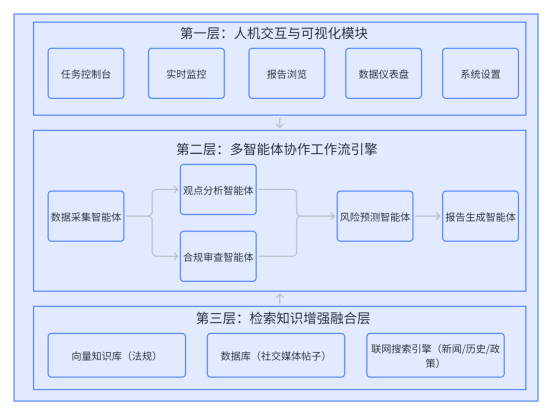

3 社交网络内容安全审核与报告生成系统概要设计
本章主要阐述系统的总体架构设计与功能模块划分。系统基于Agentic RAG（智能体驱动的检索增强生成）架构，采用LangGraph工作流编排框架，将数据采集、舆情分析、合规审查、趋势预测与报告生成等智能体组织为结构化的协作流程。本章首先给出总体设计架构，随后逐一论述各模块的功能设计与处理流程。
3.1 总体架构
本系统采用前后端分离的浏览器/服务器（B/S）架构，整体设计为自上而下的三层结构，如图3-1所示。在具体的业务逻辑划分上，该三层架构由六个核心功能模块共同承载。

第一层为人机交互与可视化层，面向审核人员提供任务控制台、实时监控、报告浏览、数据仪表盘和系统设置等操作界面，是用户与系统交互的统一入口。该层在业务上完整对应了系统的人机交互与可视化模块。
第二层为多智能体协作工作流引擎，是系统的核心处理层。该层基于LangGraph工作流编排框架，将内容安全审核的业务流程分解为五个智能体节点，分别对应系统的五个核心业务模块：数据采集与预处理模块负责获取并整理原始数据；舆情观点分析模块提取并归纳多维度舆论观点；合规审查与违规检测模块依据法律法规进行内容检测与证据链构建；趋势预测与风险研判模块结合历史规律与未来情报推演风险趋势；智能报告生成模块将各环节的结构化输出整合为完整的研判报告。五个模块按照有向无环图的拓扑结构采用串并结合的方式执行：数据采集完成后，观点分析与合规审查两个智能体并行运行，二者均完成后汇合进入风险预测环节，最终由报告生成模块整合全部结果。这一设计在保证模块间数据依赖正确性的前提下，通过并行执行缩短了整体处理耗时。
第三层为检索知识增强融合层，作为Agentic RAG架构的外部知识来源，按需为上层智能体提供数据与知识支撑。该层包含三类数据源：数据库存储原始业务数据，为数据采集模块提供基础分析素材；向量知识库收录法律法规文本并建立语义索引，为合规审查模块提供精准的法规检索能力；联网搜索引擎接入实时外部信息，为观点分析模块和风险预测模块弥补大语言模型的知识滞后问题。三类数据源分别从业务数据、规范知识与时效信息三个维度支撑上层的分析与决策需求。
本章后续各节将按照系统的数据处理顺序，对上述六个核心模块的功能设计与处理流程逐一展开阐述。

图3-1 基于检索增强技术的社交网络内容安全审核系统总体框架图
3.2 数据采集与预处理模块设计
数据采集与预处理模块是多智能体协作工作流的首个执行节点，负责为下游的舆情分析和合规审查提供经过清洗和筛选的结构化数据。社交媒体原始数据量大、格式不统一且存在大量冗余信息，若不经预处理直接输入后续分析环节，将增加大语言模型的处理负担并影响输出质量。因此，本模块根据研判任务的参数配置，从数据库中定向提取目标数据，经过清洗和语义去重后，输出一组高关注度且内容独立的事件集合，供后续智能体使用。
3.2.1 原始数据采集
本系统采用MongoDB文档型数据库存储社交媒体数据，库内设计了热搜快照、帖子内容和评论数据三个独立集合，分别存储平台榜单数据、原创帖文及其元数据、用户评论内容。数据采集模块根据用户指定的时间区间和分析类别，从上述集合中检索并提取目标数据。
在检索策略上，系统首先对用户选定的日期区间进行边界规范化处理，确保查询范围覆盖完整的业务时段。在此基础上，系统根据预设的6个分析类别（综合、社会、高校、科技、政治、生活）对热搜词条进行定向过滤。对于未判断类别标签的历史数据，系统通过大语言模型进行批量分类补全，将推理结果回写至数据库以支持后续复用。
3.2.2 数据清洗与事件筛选
原始数据经采集后需进行清洗和筛选，以保证数据的可用性。系统首先对数据执行完整性校验和格式统一处理，消除缺失字段和格式不一致等问题。随后，模块对热搜词条按精确匹配进行初步聚合，合并同名词条并累计热度值，生成候选事件集合。
针对舆情数据中常见的“同一事件对应多个不同热搜话题”的冗余现象，系统进一步引入大语言模型进行语义级别的去重处理，识别并合并语义相同但措辞不同的词条，从候选集合中筛选出具有代表性的独立事件。经过上述处理，模块最终输出一组去重后的事件列表，作为下游观点分析智能体的输入。
3.3 舆情观点分析模块设计
舆情观点分析模块承接数据采集节点输出的事件列表。由于单个热点事件往往关联大量帖子和评论，直接将全部文本拼接后送入大语言模型进行分析，容易超出模型的上下文窗口限制，且难以保证分析的充分性。为此，本模块采用映射-归约（Map-Reduce）处理范式，将事件级别的整体分析分解为帖子级别的局部分析（映射）和跨帖子的综合归纳（归约）两个阶段，通过分治策略解决大规模文本的处理问题。
3.3.1 基于检索增强的事实核查
在进入观点分析之前，模块首先通过联网搜索引擎获取事件的客观背景信息。智能体根据事件名称和时间范围构造查询语句，检索来自主流媒体和权威机构的相关报道，提取后整理为结构化的事实背景材料。该环节为后续分析提供事实参照，使模型能够区分客观事实与主观评价，降低因缺乏背景知识而产生错误判断的风险。
3.3.2 映射阶段：单帖观点聚类
映射阶段对每个热门帖子及其评论区独立执行观点提取。系统通过并行处理方式，对各帖子的评论内容进行分析，提取其中的主要观点阵营、各阵营的情绪倾向、声量占比以及评论区内的观点对立程度。核心分析维度的定义如表3-1所示。
表3-1 舆情观点聚类核心分析维度定义
分析维度	维度说明	业务价值
观点阵营	提取评论区中并存的主流观点集合（通常2-3个），概括其核心诉求或论点。	识别舆论场中的主要矛盾与共识，避免观点单一化。
情绪极性	标注每个观点阵营的情绪色彩（如愤怒、同情、嘲讽、理性、中立）。	量化不同群体的非理性程度，预判情绪演化趋势。
声量占比	估算持有该观点的评论在当前帖子总评论样本中的大致百分比。	评估主流舆论与边缘声音的力量对比，确定主导风向。
舆论对立度	判定评论区内是否存在激烈的观点交锋或骂战。	分析舆情的冲突风险点。
每个帖子的分析结果以统一的结构化格式输出，作为归约阶段的输入。
3.3.3 归约阶段：事件深度分析生成
归约阶段将同一事件下各帖子的分析结果进行汇总和综合，生成事件级别的深度分析报告。报告内容按照三个层次组织：事件概述部分结合背景检索结果还原事件经过；舆论观点部分对分散在不同帖子中的相似观点进行合并归纳，梳理整体的舆论倾向分布；深度点评部分基于事实与观点给出分析性评论，指出事件反映的深层问题和潜在风险。
3.3.4 样本去重与质量门控
模块在处理多个事件时，通过大语言模型对当前事件与已完成分析的事件进行语义比对，识别并跳过实质相同的重复事件，避免冗余分析。同时，系统对归约阶段的输出执行质量检查，验证报告的结构完整性和内容充分性。未通过检查的报告将附带具体的改进反馈重新生成，直至达到预设标准。
3.4 合规审查与违规检测模块设计
合规审查与违规检测模块与舆情观点分析模块并行执行，负责对数据采集节点输出的帖子及评论内容进行合规性检测。该模块基于检索增强生成（RAG）架构，结合大语言模型的文本理解能力与向量知识库的法规检索能力，实现“违规识别—法规匹配—证据链构建”的完整审查流程。在提示词设计上，系统采用思维链（Chain-of-Thought）等提示工程策略，引导模型依据具体的文本事实和法规条款进行逐步推理，而非直接给出笼统的判定结论。
3.4.1 审核知识库构建
审核知识库是合规审查的数据基础，用于存储平台社区规则与相关法律法规文本。系统采用向量数据库技术，利用embedding模型将法规文本转化为语义向量并建立索引，以支持基于语义相似度的条款检索。知识库的初始数据来源于平台社区公约与审核细则，经解析后以条款为单位存储，并附带违规类别、行为描述和风险等级等结构化元数据。
3.4.2 基于大语言模型的审查与RAG检索
合规审查流程分为两个步骤。第一步由大语言模型对帖子及其关联评论进行初步审查，识别其中可能存在的违规内容，提取具体的违规文本片段并给出初步的判定依据和违规类别。
第二步针对初步审查结果进行法规检索匹配。由于模型提取的违规描述与知识库中法规条款的表述方式存在差异，直接用违规描述作为查询往往检索效果不佳。为此，系统引入假设性文档嵌入（HyDE）检索策略：先由大语言模型根据违规内容生成一段模拟法规条款风格的假设性文本，再将该文本转化为查询向量进行检索，从而缩小查询与法规条款之间的语义距离。检索过程中，系统将违规类别作为元数据过滤条件，限定检索范围以提高匹配精度。
3.4.3 证据链生成
证据链构建环节将前两个步骤的结果进行整合：以模型提取的违规文本片段为事实依据，以向量检索命中的法规条款为规则依据，建立二者之间的对应关系，形成完整的证据链记录。该环节不再进行二次违规判定，而是专注于事实与规则的逻辑关联。
在证据链构建完成后，系统根据违规类别和风险等级，按照预设的处置策略映射相应的处置建议，包括内容屏蔽、账号限制、上报监管等不同层级的措施。最终的违规判定结果与处置建议以结构化格式输出，供下游的报告生成模块使用。
3.5 趋势预测与风险研判模块设计
内容安全审核系统除了对已发生的舆情事件进行分析和合规审查外，还需具备面向未来的风险预判能力。趋势预测模块的设计基于一个经验性观察：舆情风险事件往往呈现周期性和可预测性。每年特定时段的敏感节点（如全国两会期间、重大纪念日前后）、重大政策的发布实施、周期性社会事件的到来等，均可能成为舆情波动的触发因素。基于这一认识，本模块将历史同期规律的回顾与未来确定性事件的前瞻相结合，生成具有事实依据的风险预测结论。
3.5.1 基于ReAct架构的智能体设计
本模块采用ReAct（Reasoning and Acting）智能体架构实现趋势预测流程。ReAct架构的核心思想是将大语言模型的推理能力与外部工具调用能力交替执行，形成"思考—行动—观察"的迭代循环。相较于将信息检索与推理生成分离为独立阶段的方案，ReAct架构允许智能体根据中间推理结果动态调整搜索策略——在信息不足时自主发起补充检索，在信息充分时直接进入推理阶段。
智能体的搜索策略围绕两个互补的目标展开。其一是历史同期规律挖掘，即检索目标时段对应的往年同期舆情数据，识别该时段内反复出现的高发模式和周期性风险特征。其二是未来情报采集，即检索目标时段内已确定的重要事件安排，包括政策施行日期、重要会议时间、全国性考试日程、法定节日与纪念日等。智能体根据用户指定的关注领域自主构造查询关键词，并可在搜索结果不理想时自行调整关键词重试。
3.5.2 推演框架与结构化输出
在完成信息检索后，智能体依据系统提示词中预设的推演框架进入风险分析阶段。推演框架的核心逻辑可概括为：将未来必然发生的时间节点与当前的社会情绪态势进行关联分析，推导潜在的风险触发点。这一设计旨在引导模型基于客观事件与主观情绪的叠加效应进行推理，而非仅依据单一维度做出判断。
智能体的最终输出被约束为严格的结构化格式。每份预测报告包含目标预测时段、证据来源列表以及3至5个风险预测主题。每个主题须包含背景分析、风险发生可能性评级以及证据依据，其中证据依据要求明确引用检索获取的历史规律或未来情报，禁止仅凭主观推测生成内容。各主题之间须满足正交性约束，即覆盖相互独立的风险维度，避免视角重复。
3.5.3 质量控制机制
预测质量的保障依赖两层控制机制。第一层是嵌入智能体提示词中的自检清单，要求智能体在输出前逐项核查搜索覆盖度、证据充分性和主题正交性。第二层是独立的质量门控模块，对输出执行结构校验和内容评估，检查主题数量、必填字段完整性、证据引用的有效性以及预测内容的前瞻性。当评估未达标时，系统将改进反馈注入重试提示词中，引导智能体针对性修正，并设置最大重试次数以避免无限循环。
3.6 智能报告生成模块设计
研判报告是系统向用户交付的最终产品，其质量直接影响系统的实用价值。报告生成模块需平衡两方面考量：一方面完整呈现各模块的分析成果，不遗漏关键信息；另一方面具备良好的可读性和专业性，便于审核人员快速把握要点。为此，本模块采用“结构模板与数据填充相结合”的设计思路：报告的整体框架和章节排布由预定义模板确定，各章节的具体内容由前序模块的结构化输出精确映射填充，仅在需要综合性表述的环节（前言摘要）借助大语言模型进行文本生成。
研判报告采用Markdown格式输出，便于在不同平台间进行渲染展示和格式转换。报告整体划分为五个核心章节，各章节的功能定位与数据来源如表3-2所示。
表3-2 研判报告包含章节
章节名称	功能定位	数据来源	生成方式
前言摘要	概述本期舆情态势、核心发现与关键风险点	热点榜单、深度分析摘要、统计指标	大语言模型生成
热点榜单	以表格形式展示排名靠前的核心事件	数据采集模块输出的核心事件列表	模板直接填充
深度分析	对重点事件逐一展开事件概述、舆论观点与深度点评	舆情观点分析模块的结构化报告	模板直接填充
趋势预测	呈现未来时段的风险预警主题及应对建议	趋势预测模块的预测报告	模板直接填充
合规审查附录	汇总违规类别统计与典型案例的证据链和处置建议	合规审查模块的审查结果	模板直接填充

3.7 人机交互与可视化模块设计
人机交互模块是系统面向审核人员的操作入口，其设计遵循"任务驱动、状态透明、结果可视"三项原则。任务驱动要求界面以用户的工作流程为中心，提供清晰的任务创建和参数配置入口；状态透明要求系统执行过程中的关键状态对用户可见，降低多智能体协作流程的"黑箱"感；结果可视要求分析结果的呈现直观易懂，便于快速把握要点并辅助决策。
3.7.1 前端架构与视图划分
前端模块采用基于Vue框架的组件化架构，将不同功能划分为独立的视图组件，通过统一的状态管理机制保持数据同步。前端与后端之间通过标准化接口进行数据交互，支持实时状态推送以满足任务监控的需求。系统的主要视图组件及其功能定位如表3-3所示。
表3-3 前端视图组件功能说明
视图组件	功能定位	说明
数据仪表盘	全局概览	展示关键统计指标、违规类别分布图表与最新报告列表
任务控制台	任务管理	配置分析参数、发起研判任务、实时监控执行进度
报告详情	内容展示	渲染Markdown格式的审核报告，提供任务导航与下载功能
系统设置	配置管理	接口密钥、模型参数等

3.7.2 核心交互流程
数据仪表盘作为系统的默认入口页面，以统计卡片和可视化图表的形式提供历史数据的全局概览，帮助审核人员快速了解近期的舆情态势和违规分布情况，为后续的研判任务提供决策参考。
审核人员的典型操作流程可概括为"配置—监控—阅读"三个阶段。在任务配置阶段，用户通过任务控制台选择分析类别、指定研判时间范围和预测周期等核心参数，提交后系统向后端发起任务创建请求。在任务监控阶段，控制台实时展示当前执行步骤、整体进度以及各智能体的运行状态，使用户能够掌握多智能体工作流的推进情况。在结果阅读阶段，任务完成后界面跳转至报告详情页面，以结构化的方式呈现研判报告的完整内容，并支持按章节导航和导出操作。
3.8 本章小结
本章首先介绍了基于检索增强技术的社交网络内容安全审核系统的总体架构，然后分别详细阐述了该架构下的数据采集与预处理模块、舆情观点分析模块、合规审查与违规检测模块、趋势预测与风险研判模块、智能报告生成模块以及人机交互与可视化模块的设计思路与处理流程。通过本章的概要设计，明确了多智能体工作流中各节点的任务划分、数据依赖与协作关系。以上内容完成了系统从需求到架构的转化，为下一章系统各核心模块的详细设计与具体代码实现提供了总体的框架依据。
