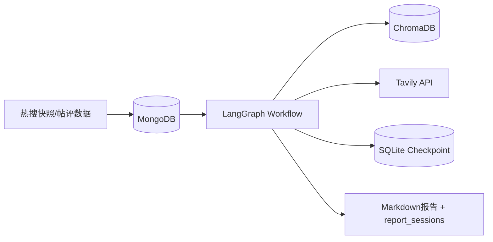
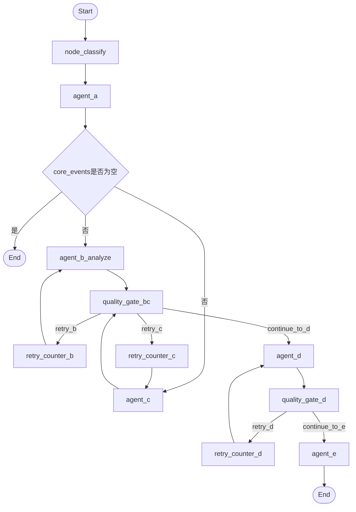
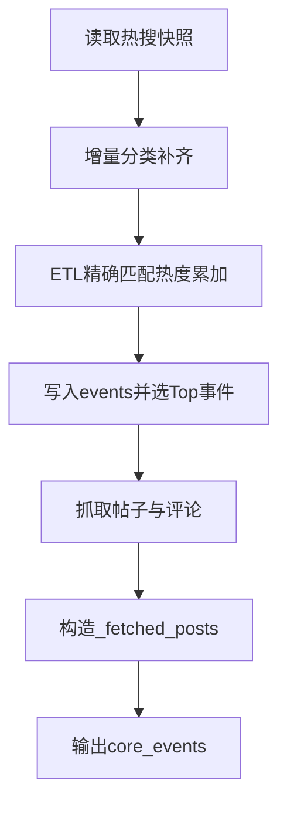
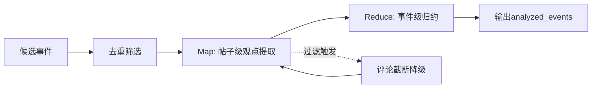
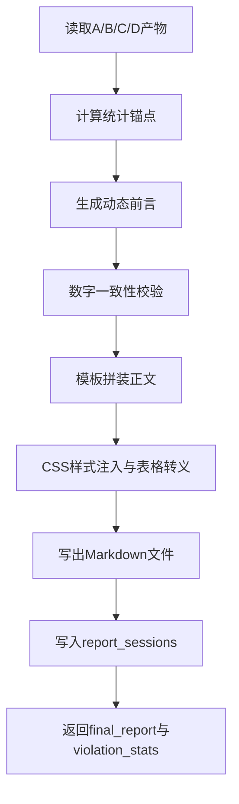
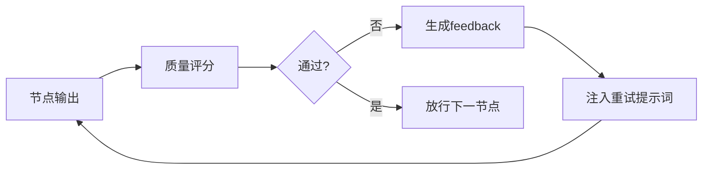
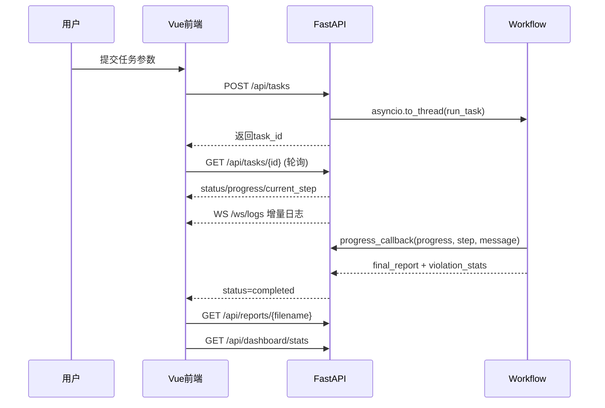

# 第四章 社交网络内容安全审核与报告生成系统详细设计

本章在第三章总体架构基础上，面向实现层回答三个连续问题：系统如何构建可落地的数据与知识底座，工作流如何在多智能体并行条件下保持稳定运行，以及核心业务模块如何形成从输入到交付的闭环链路。与"概念性说明"不同，本章强调实现证据与工程约束的同步呈现，即每一处设计都要能够在代码中找到对应落点，并通过流程图、表格和伪代码说明其执行逻辑、异常处理与边界条件。基于这一写作原则，全文采用段落化论述为主、图文表辅助论证为辅的结构组织方式，使读者在不跳转源码的情况下即可完整理解系统实现机理。

全章沿"底座→引擎→业务→治理→交互"的路径展开：首先在 4.1 节说明异构存储与检索知识增强层如何为业务提供读写分离与证据保障的数据基础，其次在 4.2 节阐释多智能体协作工作流引擎与状态机如何将并发、回溯与裁决三项能力编码进图结构，随后在 4.3 节逐一描述从数据采集到报告生成的五个核心业务模块的处理逻辑与异常降级策略，继而在 4.4 节讨论质量门控与重试路由如何以量化评分驱动可解释重试，最后在 4.5 节给出人机交互与接口调度层的服务协议与状态同步机制。这一路径覆盖了系统从输入到交付的完整链路，确保每一层设计既可向上追溯架构动因，也可向下对接代码实体。

## 4.1 检索知识增强与数据存储层详细设计

社交网络舆情分析场景同时具有动态字段、非结构化文本、流程长链路和知识时效性强等特点。在具体的数据访问模式上，上游 ETL 需要批量写入与事务性更新，中间智能体需要按关键词和日期做精准查询与向量语义检索，质量门控与断点恢复需要持久化执行快照，趋势预测则需要大模型训练截止日期之后的实时信息补偿。任何单一数据组件都难以同时满足上述四类目标，因此系统采用 MongoDB、ChromaDB、SQLite 与 Tavily 的异构协同方案，并以"职责隔离"原则避免组件混用。换言之，本节讨论的重点并非"组件数量"，而是"组件边界"：业务事实由 MongoDB 承载，流程状态由 SQLite checkpoint 维护，法规语义召回由 ChromaDB 负责，时效知识补偿由 Tavily 提供。这种职责分离使得其中任何一个组件发生性能退化或临时不可用时，其他组件所承载的功能仍能独立运行，最大程度保障系统整体可用性。

### 4.1.1 异构底座构成与职责映射

在确定组件边界之后，有必要对每个组件承载的具体数据模型、管理内容与架构功能进行精确描述。如表 4-1 所示，MongoDB 作为业务事实主存储，承载了五张核心集合：hot_trends_history 以 BSON 文档形式存储热搜快照，每条记录包含 source（固定值"weibo_social"）、collected_at（采集时间戳）以及 top_n 数组，数组中的每个元素由 word（词条文本）、num（热度数值）和可选的 category（分类标签）三个字段构成，系统通过对 collected_at 字段建立降序索引以支撑按时间范围的高效查询；events 集合存储经 ETL 清洗后的核心事件列表，保留 event_name、total_heat、related_keywords 等字段以支撑下游选题与样本拉取；weibo_contents 与 weibo_comments 分别对应主贴和评论两个粒度的原始内容，前者包含 source_keyword、content、liked_count、audit_status、is_violation、violation_info 等字段，后者通过 note_id 外键与主贴关联并以 comment_like_count 排序来优先返回高互动评论；report_sessions 记录每次任务生成的报告会话快照，包含 created_at、violation_stats（违规分类计数字典）等元数据，仪表盘直接从该集合的最新记录中读取统计数据，避免跨集合聚合查询带来的复杂性。

ChromaDB 作为向量检索引擎，维护名为 weibo_audit_rules 的向量集合，其嵌入模型采用兼容 OpenAI 接口的 OpenAIEmbeddings 实例，通过 BAAI_API_KEY、EMBEDDING_MODEL 与 EMBEDDING_BASE_URL 三项配置参数指定模型服务端点。ChromaDB 采用延迟初始化策略，当嵌入模型配置缺失时系统向日志输出警告信息并将 RAG 结果降级为空列表，而非抛出异常阻塞后端启动。这一设计确保了即便向量检索暂不可用，合规审查模块仍可基于 LLM 自身知识完成基本判定，只是缺少法规条款层面的外部证据支撑。

SQLite 仅承载 LangGraph 框架的 SqliteSaver checkpoint 功能，通过 thread_id 维度保存每个节点执行后的状态快照，不涉及业务数据的持久化存储。这种分离确保了流程恢复逻辑不会污染业务库字段结构，反之业务字段的变更也不会影响 checkpoint 的序列化格式。Tavily API 以在线检索服务的形式提供实时新闻与公开网页上下文，其调用入口分布在 agent_b_analyze 的 get_web_context 方法和 agent_d 的 tavily_search ReAct 工具中，分别用于补充观点分析的事件背景与趋势预测的时效情报。

表 4-1 异构数据与知识存储底座构成与职责映射表

| 存储/检索组件 | 数据结构/模型 | 代码可证实的核心管理内容 | 架构作用与功能支持 |
|---|---|---|---|
| MongoDB | 文档型（BSON） | hot_trends_history、events、weibo_contents、weibo_comments、report_sessions | 业务事实主存储，支撑热搜快照、事件归并、帖子评论审核回写、报告会话归档与仪表盘快照读取 |
| ChromaDB | 稠密向量（Dense Vector） | weibo_audit_rules 向量集合；按 category 过滤的相似度检索；可选 HyDE 增强 | 合规审查证据增强，提供法规语义召回与条款映射依据 |
| SQLite（Checkpoint） | 关系型（SQLite） | LangGraph checkpoint 快照与 thread_id 级恢复 | 为长流程提供断点续传能力，保障异常中断后无损恢复 |
| Tavily API | 外部在线检索 | 实时新闻与公开网页上下文（工具调用返回文本证据） | 填补模型时效盲区，服务观点分析事实补充与趋势预测外部情报 |

从表 4-1 可以看出，四个组件分别覆盖了"结构化事实存储""语义向量检索""流程状态持久化""时效知识补偿"四个正交职责。在实际运行中，工作流的每一个节点依据自身阶段需求选择性地访问其中一个或两个组件，而非对所有组件进行统一读写。这种按需访问的模式不仅降低了单次节点执行的 I/O 开销，也使得组件替换或升级可以在不影响其余模块的前提下独立完成。

### 4.1.2 读写调用映射与数据流

在明确各组件的职责边界后，需要进一步回答"哪个智能体节点在什么时候需要访问哪个组件"这一问题。如表 4-2 所示，读写调用在节点维度呈现出清晰的访问模式：node_classify 节点同时读写 MongoDB 的 hot_trends_history 集合，其读操作是获取指定日期范围内的全部热搜词条及其已有分类标签，写操作则是将增量分类结果回写到 top_n 数组中对应词条的 category 字段。在日期查询的实现上，系统通过 _parse_date_or_datetime 函数支持"YYYY-MM-DD"纯日期与"YYYY-MM-DD HH:MM:SS"完整时间两种格式，若传入纯日期则自动扩展为当天的 00:00:00 至 23:59:59.999999，所有日期时间对象统一强制设置东八区时区信息以消除跨时区歧义。

agent_a 节点的访问范围最广，其读路径涵盖 hot_trends_history（获取原始热搜）、weibo_contents（按关键词拉取主贴）与 weibo_comments（按帖子 ID 拉取评论），写路径则经由 events 集合持久化 ETL 清洗后的核心事件。在帖子查询实现中，get_posts_by_keywords 方法使用 MongoDB 的 collation 机制并指定 numericOrdering 为 True，以解决 liked_count 等字段在数据库中以字符串形式存储时的排序失真问题；若数据库引擎不支持该特性则自动降级为普通排序。评论查询同样遵循此模式，通过 comment_like_count 降序排列优先返回高互动评论。

agent_b_analyze 与 agent_c 处于并行分支，二者的数据访问路径互不交叉：B 分支读取 core_events 中封装好的样本数据并通过 Tavily 的 get_web_context 方法补充事件背景信息，C 分支在完成违规判定后调用 ChromaDB 的 search_related_laws 方法检索法规条款，并将审查结果通过 _bulk_update_audit 方法批量回写到 weibo_contents 与 weibo_comments 两个集合的 is_violation、violation_info 与 audit_status 字段。agent_d 以 B 与 C 的产物摘要为输入，通过 ReAct 模式中的 tavily_search 工具执行外部检索增强推理。agent_e 在报告生成完成后，将 Markdown 文本、违规统计与核心事件列表一并写入 report_sessions 集合。仪表盘的查询入口 get_dashboard_violation_stats 则仅读取 report_sessions 中按 created_at 降序排列的第一条记录，提取其 violation_stats 或 violation_category_counts 字段作为当前违规分布数据。

表 4-2 组件读写调用映射表

| 模块/节点 | MongoDB | ChromaDB | SQLite Checkpoint | Tavily |
|---|---|---|---|---|
| node_classify | 读写 hot_trends_history 分类字段 | 否 | 执行后写快照 | 否 |
| agent_a | 读 hot_trends_history；写 events；读 weibo_contents/weibo_comments | 否 | 执行后写快照 | 否 |
| agent_b_analyze | 读 core_events 扩展样本（来源 Mongo） | 否 | 执行后写快照 | get_web_context 联网补充事实 |
| agent_c | 读样本并回写 weibo_contents/weibo_comments | search_related_laws（可选 HyDE） | 执行后写快照 | 否 |
| agent_d | 读 analyzed_events/audit_results 摘要 | 否 | 执行后写快照 | ReAct 工具 tavily_search |
| agent_e | 写 report_sessions | 否 | 执行后写快照 | 否 |
| dashboard | 读 report_sessions 最新快照 | 否 | 否 | 否 |

图 4-1 展示了上述读写关系在整体数据流中的主路径。业务原始数据（热搜快照与帖评内容）首先进入 MongoDB 完成持久化，随后工作流节点按任务阶段从 MongoDB 读取所需数据，并在适当时机调用 ChromaDB 与 Tavily 完成证据增强和事实补充，每个节点执行结束后由 SQLite checkpoint 持续保存执行状态快照。该结构的关键收益在于读写解耦：即便 Tavily 因网络波动暂时不可达或 ChromaDB 嵌入模型服务出现延迟，业务主数据的读写链路与任务恢复链路仍可独立工作，不会因某一辅助组件的瞬时故障导致整个流程中断。

图 4-1 异构底座协同数据流



### 4.1.3 关键算法：断点快照与恢复机制

在多智能体长链路工作流中，单次任务从输入到报告生成通常需要数分钟乃至更长时间，期间可能遭遇网络中断、LLM 服务超时或进程异常终止等意外情况。若缺乏状态持久化机制，则必须从头重新执行整条链路，不仅浪费 API 调用预算，还可能因重复写入导致数据不一致。系统基于 LangGraph 框架提供的 SqliteSaver 组件实现了基于 thread_id 的断点快照与恢复机制。

具体实现中，run_task 函数在启动时首先创建 SqliteSaver 实例并将其注入工作流的编译参数中。每当一个节点执行完毕并将返回值合并到 GraphState 后，SqliteSaver 自动将当前完整状态序列化并以 thread_id 为键写入 SQLite 数据库。当使用相同 thread_id 再次调用 app.stream 时，LangGraph 框架自动检测到该 thread_id 已有历史快照，于是从最近一次成功的快照位置恢复执行，跳过已完成的节点。工作流以流式模式运行，每产生一个增量结果（delta）即向前端推送进度通知，最终通过 app.get_state 获取终态作为函数返回值。

算法 4-1 断点快照与恢复伪代码

```text
function run_task(thread_id, initial_state):
    with SqliteSaver(checkpoint_db) as checkpointer:
        app = workflow.compile(checkpointer=checkpointer)
        config = { configurable: { thread_id: thread_id } }

        # 若 thread_id 已存在，LangGraph 自动从最近快照恢复
        for delta in app.stream(initial_state, config):
            emit_progress(delta)

        final_state = app.get_state(config)
        return final_state
```

如算法 4-1 所示，该机制的工程意义在于：流程状态持久化与业务数据持久化各自独立运行而互不干扰。MongoDB 负责业务事实的增删改查，SQLite 仅负责执行上下文的序列化与反序列化，二者的表结构、读写频率与生命周期管理完全隔离。这种解耦使得系统在进行业务字段变更或集合重构时无需考虑对 checkpoint 格式的影响，反之 LangGraph 框架升级 checkpoint 序列化策略时也不会引发业务数据层的兼容性问题。此外，由于每个 thread_id 的快照序列是线性递增的，系统还具备了按 thread_id 查询历史执行轨迹的潜力，为后续运维审计与执行回放提供了数据基础。

## 4.2 多智能体协作工作流引擎与状态机设计

在完成底层数据与知识底座的设计之后，需要解决的核心问题是如何将多个功能各异的智能体组织为可靠且高效的协作流程。系统使用 LangGraph 将多智能体编排为有向无环图（DAG），并以 GraphState 作为统一状态平面，确保并行节点读同源、写异域，门控节点集中路由，最终实现"可并发、可回溯、可裁决"的流程控制。该设计将"业务处理顺序"与"质量治理顺序"同时编码进图结构，使系统既能通过并行分支缩短端到端耗时，又能在关键汇聚节点收敛结果质量。与传统的线性调用链相比，这种基于图的编排模式天然支持条件分支、并行扇出与回路重试三种拓扑结构，使得工作流的拓展与维护均可在图定义层面完成，无需修改节点内部逻辑。

### 4.2.1 DAG 拓扑与路由规则

系统工作流共注册 11 个节点、3 个条件路由函数和若干线性边，它们共同构成了一个支持并行、门控与重试回路的有向无环图。如图 4-2 所示，工作流从 START 出发，首先经过 node_classify 完成热搜词条分类，随后进入 agent_a 执行 ETL 选题与样本抓取。agent_a 执行完毕后，路由函数 should_continue 检查状态中 core_events 是否为空：若为空则直接终止流程，说明当前时间窗口内没有可分析的有效事件数据；若非空则返回一个包含 "analyze" 和 "audit" 两个目标的列表，LangGraph 框架接收到列表类型的路由结果后自动将其解释为并行扇出指令，同时启动 agent_b_analyze（舆情观点分析）和 agent_c（合规审查）两个分支。

两个并行分支完成后的输出自动汇聚到 quality_gate_bc 节点。该门控节点对 B 和 C 的输出分别进行质量评分，然后由路由函数 route_after_bc_gate 根据评分结果决定后续去向。其路由逻辑遵循如下优先级规则：若 B 和 C 均通过评分阈值，则路由到 agent_d 继续执行趋势预测；若 B 未通过且 B 的重试次数尚未达到上限（MAX_RETRIES=1），则路由到 retry_counter_b 节点递增重试计数后再次执行 agent_b_analyze；C 的重试判定逻辑与 B 完全对称；若重试次数已达上限，则无论评分结果如何均降级放行至 agent_d，避免因某一分支的质量缺口阻塞整条流程。agent_d 完成后同样经过 quality_gate_d 的评分与路由裁决，通过则进入 agent_e 生成最终报告，未通过则在重试限额内回路重试。

图 4-2 多智能体工作流拓扑



从图 4-2 可以看到，系统并未采用单链串行执行，而是在 A 节点完成输入准备后并行触发 B、C 两条分析链，再通过质量门控进行统一裁决。这种"并行处理 + 汇聚评估"的结构显著降低了端到端耗时，同时保留了对输出质量的集中控制能力。路由判据按质量门控阈值执行，其通过条件可表示为：

$$
passed=(completeness\ge8)\land(accuracy\ge8)\land(depth\ge8)
$$

当某分支未达阈值且对应重试次数未超限（MAX_RETRIES=1）时，进入对应重试节点；超限后降级放行，避免流程长时间阻塞。需要特别说明的是，重试计数节点（retry_counter_b/c/d）并非简单的计数器，它们在递增 retry_count 字典中对应键值的同时，还将质量门控输出的 feedback 文本以"请改进: {feedback}"的格式写入 supervisor_feedback 字段，使后续的节点重新执行时能够通过 improvement_hint 参数接收到定向改进建议，而非盲目重复上一轮的处理逻辑。

### 4.2.2 GraphState 字段契约

GraphState 以 TypedDict 形式定义，承担着全流程数据容器与节点间契约两重角色。它的 27 个字段按功能可划分为会话控制、时间与筛选、主数据、各智能体产物、质量门控与系统控制六大分组（如表 4-3 所示）。每个节点在执行前从 GraphState 中读取所需的输入字段，执行后将产物写回对应的输出字段，这种"按名契约"的方式使得节点之间的数据依赖关系通过字段名即可显式追踪，无需额外的消息路由配置。

在并发场景下，字段的写入策略需要特别关注。LangGraph 采用注解（Annotated）机制为特定字段指定合并策略：messages 字段使用框架内置的 add_messages 合并器，对 BaseMessage 列表执行去重追加操作，确保并行节点各自产生的对话消息能够有序汇入同一消息序列；supervisor_feedback、error 与 current_step 三个字段均使用自定义的 _last_value 合并器（即取最后一个写入值），这一设计的动机在于当 B 与 C 并行分支同时完成时，它们可能同时尝试写入 current_step，若使用默认的覆盖策略则会触发 LangGraph 的 InvalidUpdateError 异常，而 _last_value 策略将此场景视为合法的并发更新，始终取最后到达的值作为最终结果。其余字段（如 analyzed_events、audit_results 等）由于在物理上分属于不同的并行分支，不存在并发写入冲突，因此无需指定特殊合并策略。

表 4-3 GraphState 字段分组与语义

| 字段组 | 代表字段 | 作用 |
|---|---|---|
| 会话控制 | task_id, user_query, current_step, error | 标识任务上下文与当前执行阶段 |
| 时间与筛选 | start_date, end_date, category, forecast_range | 限定处理窗口与预测范围，category 支持"综合""社会""高校""生活""科技""政治""其他"七种枚举值 |
| 主数据 | raw_trends, core_events | 主流程输入与事件级样本容器，core_events 由 agent_a 产出并供 B、C 并行读取 |
| B 产物 | analyzed_events | 观点分析结构化结果，包含 event_overview、public_opinions、depth_analysis |
| C 产物 | pending_posts, audit_results | 审查对象与违规结果集，audit_results 包含 is_violation、violation_info、matched_laws |
| D 产物 | trend_forecast | 未来风险结构化预测，包含 target_period、topics 列表及每个议题的预测点 |
| E 产物 | final_report, violation_stats | 报告正文（Markdown 格式）与违规分类计数字典 |
| 质量门控 | quality_scores, retry_count, supervisor_feedback | 评分字典（按 agent_name 索引）、重试计数字典、改进反馈文本 |
| 可选扩展 | historical_events | 历史回顾数据（当前主链未启用，为后续版本预留） |

从表 4-3 中可以观察到，字段分组严格遵循"谁写谁命名"的原则：B 产物只由 agent_b_analyze 节点写入，C 产物只由 agent_c 节点写入，二者的字段名在语义和命名上互不重叠。这种按分支命名的字段划分策略是并行执行安全性的基础保障之一。

### 4.2.3 并发读写一致性控制

并发一致性的实现遵循"共享读、分区写、门控汇总"三层原则，从数据流的入口到出口形成完整的一致性保障链。在第一层（共享读）中，B 与 C 并行分支在启动时读取同一份 core_events 数组。由于 LangGraph 在扇出并行分支时对状态进行了浅拷贝，两个分支获得的 core_events 引用指向同一份不可变对象。在整个分支执行生命周期内，二者均不向 core_events 字段写入任何内容，从而保证两条链路在整个执行过程中始终建立在一致的输入基线之上。

在第二层（分区写）中，B 分支产出的结果只写入 analyzed_events 字段，C 分支产出的结果只写入 audit_results 与 pending_posts 字段。这种字段级的职责划分在设计上排除了两个并行分支对同一字段的竞争写入，使得即便在极端情况下两个分支几乎同时完成执行，其状态合并操作也不会产生覆盖冲突。对于 current_step、error 和 supervisor_feedback 这三个类似控制平面的字段，由于它们在语义上需要反映"当前最新进展"而非"历史完整记录"，系统采用覆盖写策略（Annotated[str, _last_value]），取最后到达的值作为有效值。与此相对，messages 字段采用聚合追加策略（Annotated[list, add_messages]），确保分析阶段和审查阶段各自产生的 LLM 对话消息均被完整保留在消息列表中，不会因并发合并而丢失。

在第三层（门控汇总）中，quality_gate_bc 节点在两个分支均完成后才开始执行。它从已合并的状态中同时读取 analyzed_events 和 audit_results，对二者分别调用质量评估函数以生成评分与反馈，然后将评分结果写入 quality_scores 字典。由此可见，门控节点在时序上总是位于并行分支的汇聚点之后，它天然地承担了"读取并行分支产物并做集中裁决"的角色。每个节点执行结束后均由 checkpointer 持久化快照，从而确保任务在中断场景下可按 thread_id 恢复到最近成功状态，不会因并行分支中途中断而出现一侧产物丢失、另一侧产物保留的不一致局面。

## 4.3 核心业务模块详细设计

### 4.3.1 数据采集与预处理模块详细设计

该模块对应 node_classify 与 agent_a 两个连续执行的工作流节点，目标是把快照级热搜与原始帖评数据转化为事件级统一样本，为下游 B、C 并行分析提供结构一致、字段完整且可并行消费的稳定输入。其实现思路可概括为"先修正标签、再聚合事件、后扩展样本"三个阶段，每个阶段的输出即为下一阶段的输入，形成单向流水线式的处理路径。

在分类补齐阶段（对应 node_classify），系统并非对所有热搜词条重新执行分类，而是首先通过 get_existing_categories 方法从 MongoDB 中检索指定日期范围内已有分类标签的词条，将其构造为 {word: category} 字典。随后，系统从全量词条集合中减去已有分类的词条，仅对差集部分调用 LLM 进行分类推断。这种增量更新策略的工程价值在于避免对已确定标签的词条重复调用大模型，一方面节约了 API 调用成本，另一方面消除了同一词条在不同批次中被分配到不同类别的结果抖动风险。分类结果通过 update_hot_search_categories 方法批量回写到 hot_trends_history 集合中对应快照的 top_n 数组，回写操作逐个检查数组中的词条是否存在于分类映射表中且其 category 字段为空，仅在两个条件同时满足时才执行更新，进一步避免覆盖已有的人工标注或先前批次的分类结果。值得注意的是，当 category 参数为"综合"时，系统跳过整个分类阶段，直接进入 ETL 流程，因为综合模式不需要按类别筛选事件。

在 ETL 聚合阶段（对应 agent_a 的前半段），系统以精确字符串匹配方式将不同快照中的同名热搜词条的热度值进行累加，生成事件级的 total_heat 排行榜。这里采用精确匹配而非语义相似度匹配的设计决策是有意为之的：精确匹配保证了热度累加的可追溯性，即任何一个事件的 total_heat 值都可以逆向分解为"文本完全相同的词条在各快照中的 num 值之和"，审计人员可以通过简单的字符串过滤验证该数值的正确性。相比之下，语义匹配虽然能将"高考改革"和"新高考方案"等近义表述合并为同一事件，但其合并规则依赖于嵌入模型的相似度阈值，不同模型和不同阈值可能产生不同的聚合结果，这在需要可解释性的审计场景中是不可接受的。聚合完成后，事件按 total_heat 降序排列，取前 50 条写入 events 集合并从中选取前 20 条作为核心事件候选。

在样本扩展阶段（对应 agent_a 的后半段），系统对入选的核心事件并行执行帖子与评论的拉取操作。对于每个核心事件，系统以其 related_keywords 列表作为查询条件，调用 get_posts_by_keywords 方法从 weibo_contents 集合中检索匹配的主贴（上限 15 条），再调用 get_comments_by_post_ids 方法按帖子 note_id 拉取对应评论（上限 200 条，按 comment_like_count 降序排列优先获取高互动评论）。拉取到的主贴与评论经过归一化处理后统一封装到事件对象的 _fetched_posts 字段中。对于抓取过程中出现异常的个别事件，系统采用 try-except-continue 模式跳过该事件并在日志中记录警告信息，以保持主链的连续性，从而避免单点数据缺失拖垮整批任务的处理。最终，携带 _fetched_posts 数据的核心事件列表写入 GraphState 的 core_events 字段，同时供 B、C 两条并行链路共享读取。

图 4-3 数据采集与预处理流程



如图 4-3 所示，整个模块从读取热搜快照开始，经过增量分类补齐、ETL 精确匹配热度累加、写入 events 并选取 Top 事件、抓取帖子与评论、构造 _fetched_posts 统一数据包，最终输出 core_events。每一步的输出都是下一步的唯一输入，不存在跨步骤的数据反馈回路。

算法 4-2 数据采集与预处理伪代码

```text
if category != "综合":
    words = unique(load_hot_trends(start_date, end_date))
    existing = load_existing_categories(start_date, end_date)
    to_classify = words - existing.keys()
    new_labels = parallel_classify(to_classify)
    write_back_categories(existing + new_labels)

events = etl_merge_exact_match(start_date, end_date, category)
if events is empty:
    return core_events=[]

top_events = rank_by_heat(events, top_n=50)
for evt in top_events[:20] parallel:
    try:
        posts = load_posts(evt.related_keywords, limit=15)
        comments = load_comments_for_posts(posts, limit=200)
        evt._fetched_posts = normalize_packets(posts, comments)
    except:
        continue

return core_events=top_events_with_samples
```

从算法 4-2 可见，该模块在实现上将"增量更新""确定性聚合""局部失败隔离"三个目标统一起来：增量更新保证分类成本可控且结果稳定，确定性聚合保证事件热度值可逐条追溯且可独立审计，局部失败隔离保证不会因个别事件的数据拉取失败而终止整个任务流程。这三者的协同正是该模块能够稳定支撑后续多智能体并行处理的核心原因。

### 4.3.2 舆情观点分析模块详细设计

该模块对应 agent_b_analyze 节点，采用 Map-Reduce 范式完成"帖子级观点提取到事件级归约"的两段式建模，是系统中对 LLM 调用密度最高的模块。其 LLM 实例配置为 temperature=0.3（倾向于生成稳定、可复现的分析结论）、request_timeout=180 秒和 max_retries=3，提示词以 AGENT_B_MAP_TEMPLATE 与 AGENT_B_REDUCE_TEMPLATE 为核心，重点约束阵营识别、情绪结构与冲突关系，确保输出不仅有结论，而且能反映社会心理层面的观点分层。

在执行链路上，模块并非直接对所有核心事件执行分析，而是先经过去重治理环节以控制分析预算。去重逻辑优先使用 LLM 结构化判重——将事件标题作为输入，由模型判断哪些事件在语义上属于同一议题；若结构化调用因异常或内容安全拦截而失败，系统回退到基于规则的判重方案（如关键词重叠度阈值），确保去重功能在任何条件下可用。经去重筛选后的事件（上限 5 个）才进入正式的 Map-Reduce 处理流程。

Map 阶段的核心目标是从每篇帖子及其评论中提取结构化的观点摘要。具体实现上，系统使用 ThreadPoolExecutor 创建最多 8 个并行工作线程（max_workers=8），为每个帖子提交一个 _map_single_post 任务。每个任务将帖子正文（post_content）、媒体链接（media_context）和格式化评论列表（comments_text）作为输入传递给以 AGENT_B_MAP_TEMPLATE 驱动的结构化输出链（llm.with_structured_output(PostOpinionSummary)），模型输出包含 opinion_clusters（观点簇列表，每个簇标注立场、情绪和占比）和 conflict_analysis（冲突关系描述）两个核心字段。当某个帖子的内容触发 LLM 提供方的内容安全拦截时，系统执行分级降级策略：第一次重试将评论截断至前 30 条以降低上下文中的敏感内容浓度；若仍触发拦截，则第二次重试完全移除评论，仅保留帖子正文进行分析；若三次尝试均失败则跳过该帖子，在日志中记录警告后继续处理其余帖子。内容安全拦截的判定通过检查异常消息中是否包含 content_filter、sensitive、refused、harmful、responsibleaipolicy、safety 等关键词来实现。

Reduce 阶段的目标是将多个帖子级的 Map 结果聚合为一份事件级的深度分析报告。系统首先遍历所有 Map 结果，提取每个帖子的 opinion_clusters 和 conflict_analysis，按固定格式组织为"帖子分析切片"文本片段。随后，系统从每个帖子的原始评论中挑选至多 8 条（每条截断至 120 字）作为代表性评论摘录。所有格式化后的切片和摘录拼接成 mapped_summaries 长文本，与事件名称、报告时段和联网检索获得的背景信息（web_context）一起传入 AGENT_B_REDUCE_TEMPLATE 驱动的结构化输出链（llm.with_structured_output(EventAnalysisReport）），模型输出 EventAnalysisReport 对象包含 event_overview（事件概况）、public_opinions（公众观点画像列表）和 depth_analysis（深度研判分析）三个核心字段。若 Reduce 阶段触发内容安全拦截，系统将 Map 结果截断至前 5 条后重试，进一步降低输入的敏感浓度。联网检索通过 get_web_context 方法实现，其搜索词格式为"{event_name} {period_hint} 事件详情 官方通报"，返回至多 3 条基础深度的网页检索结果文本，在网络异常时降级为"暂无网络背景信息"。

图 4-4 舆情观点分析流程



算法 4-3 舆情观点分析伪代码

```text
selected = deduplicate_events(core_events, max_n=5)
results = []
for event in selected:
    web_context = get_web_context(event.name, max_results=3, search_depth="basic")

    try:
        mapped = parallel_map_posts(event._fetched_posts, MAP_TEMPLATE, max_workers=8)
        report = reduce_event(mapped, REDUCE_TEMPLATE, web_context)
    except ContentFilterError:
        mapped = parallel_map_posts(truncate_comments(event._fetched_posts, limit=30), MAP_TEMPLATE)
        report = reduce_event(mapped[:5], REDUCE_TEMPLATE)
    except:
        continue
    results.append(attach_report(event, report))

return analyzed_events=results
```

从算法 4-3 可见，该模块的关键不在于"模型调用次数"，而在于"分析预算分配方式"：通过去重筛选把预算优先分配给非重复、信息密度高的事件，通过并行 Map 提升吞吐量，通过分级降级在内容安全拦截场景下保留可用主干信息，最后通过 Reduce 聚合生成具有观点分层深度的结构化分析报告。这种策略使模块在复杂样本条件下仍能稳定输出可用于后续趋势预测与报告生成的结构化观点结果。

### 4.3.3 合规审查与违规检测模块详细设计

该模块对应 agent_c 节点，围绕"主贴 + 评论"双粒度对象执行批量合规审查，并通过 ChromaDB 向量检索完成法规证据增强，输出包含"违规判定 + 法规条款依据 + 证据链"三位一体的审查结果。模块的 LLM 实例配置为 temperature=0.1（倾向于确定性判定，降低违规识别的随机波动）、request_timeout=180 秒和 max_retries=3，审查行为由 AGENT_C_BATCH_TEMPLATE 提示词严格约束。

审查边界约束是该模块区别于通用内容分类器的核心设计要素。AGENT_C_BATCH_TEMPLATE 对模型行为提出三项硬性要求：第一，默认合规——未经充分举证的内容一律判定为合规，禁止"宁可错杀不可放过"的扩张式判定；第二，禁止扩张解释——违规结论必须基于原文中实际出现的文本片段，不得基于推测或联想进行延伸定性；第三，引用对齐——每一条违规判定必须附带 quote 字段（原文逐字引用）和 reasoning 字段（判定理由），使审计人员可以直接核对违规结论与原始内容之间的对应关系。系统内置了覆盖 9 大类共 51 个细分违规标签的分类体系，涵盖时政有害（国家安全、极端主义、英烈历史、社会秩序）、违法信息（公共秩序、色情、违禁品、网暴煽动等 11 项）、诈骗信息（仿冒、投资等 6 项）、不良信息、人身攻击、侵权权益、不良价值、不实信息及 AI 生成标识等场景。

在输入预处理环节，系统通过 _sanitize_for_llm 方法对帖子正文和评论文本进行四层脱敏处理以降低触发 LLM 提供方内容安全拦截的概率。第一层是重复内容折叠，使用正则表达式识别连续出现三次或以上的相同句子（4 至 50 字符长度）并替换为单次出现加"重复内容已折叠"标记。第二层是敏感词部分遮盖，系统维护包含 39 个高敏感词汇的列表（如自杀、杀人、割腕等），对每个词保留首尾字符、中间以星号替代。第三层是敏感短语整体替换，将涉及未成年人侵害等复合敏感表述替换为抽象描述标记。第四层是文本截断，超过 2000 字符的内容截断至该长度并附加说明性后缀。这四层脱敏层层递进，力求在保留足够语义信息供模型判定的同时，将输入中的敏感浓度控制在 LLM 服务商的安全策略阈值之下。

批量审查的执行采用 batch_audit 方法，其以主贴正文、格式化评论列表和媒体上下文为输入，通过 llm.with_structured_output(BatchComplianceResult) 链执行结构化输出调用。若首次调用触发内容安全拦截，系统进入二级降级重试：先去除引用引号内容并将评论截断至前 10 条，以"高度脱敏输入"的标注重新提交；若二级重试仍失败，则返回一个 is_post_violated=False、violated_comments 为空列表的默认合规结果，确保审查流程不会因单篇内容的审查失败而中断。

在获得初步的违规判定结果之后，系统进入 RAG 证据增强阶段。batch_audit_with_rag 方法首先从 batch_audit 返回的 violated_items 中去重提取所有违规类别标签，然后为每个类别构造检索查询：将该类别下所有违规项的 quote 与 reasoning 文本拼接并截断至 500 字符作为 hyde_query。该查询传入 ChromaDB 的 search_related_laws 方法时，若启用 HyDE（默认开启），系统首先对 hyde_query 执行输入脱敏，然后通过一个专用 LLM 链（temperature=0.3、超时 30 秒）将违规行为描述改写为一条不超过 50 字的假设性平台社区公约条款文本，再以该假设文档的嵌入向量做近邻检索，从而将"自然语言违规描述"与"法规条款正式文本"之间的语义鸿沟缩小。若查询文本在脱敏后短于 5 个字符或 HyDE 链调用失败，系统自动降级为使用原始 query 直接检索。每个类别返回 top_k=2 条最相关法规条款记录，记录中包含 category（类别）、article（条款编号）、risk_level（风险等级 High/Medium/Low）、rule（条款正文）和 full_desc（完整条款描述）五个字段。

检索完成后，系统执行两项后处理操作：一是将检索到的法规条款的 risk_level 回填到对应的 violated_items 中，并根据所有违规项的最高 risk_level 计算该帖子的 overall_risk_level；二是将违规项列表与法规条款列表传入 AGENT_C_EVIDENCE_TEMPLATE 驱动的 LLM 链生成 ComplianceEvidenceReport 证据链报告，包含推理过程、处置建议和引用的法律条款列表。最终，模块将审查结果（含违规判定、法规条款和证据链）分别回写到 weibo_contents 和 weibo_comments 两个 MongoDB 集合中对应记录的 is_violation、violation_info 和 audit_status 字段，通过 _bulk_update_audit 方法以 UpdateOne 操作批量执行以减少数据库交互次数。

图 4-5 合规审查与证据增强流程

```mermaid
flowchart TD
    C1[主贴+评论输入] --> C1a[四层输入脱敏]
    C1a --> C2[批量违规定性]
    C2 --> C3{是否命中违规}
    C3 -- 否 --> C7[写回合规状态]
    C3 -- 是 --> C4[按类别构造检索query]
    C4 --> C5[Chroma检索(可选HyDE)]
    C5 --> C5a[回填risk_level]
    C5a --> C6[证据链生成]
    C6 --> C7[双粒度回写帖子与评论]
    C7 --> C8[输出audit_results]
```

如图 4-5 所示，整个合规审查流程可分为"脱敏→判定→检索增强→证据链生成→回写"五个阶段，每个阶段的失败均有对应的降级策略：脱敏阶段通过截断与遮盖保障输入可送达模型，判定阶段通过二级重试保障审查可完成，检索阶段通过 HyDE 降级为直接检索保障条款可召回，证据链阶段在 LLM 调用失败时返回空证据报告保障流程可继续，回写阶段使用批量 UpdateOne 减少交互次数并在回写失败时记录日志而不终止流程。

算法 4-4 合规审查与证据增强伪代码

```text
for post in target_posts:
    sanitized_content = sanitize_for_llm(post.content)
    sanitized_comments = sanitize_for_llm(post.comments)
    batch_result = batch_audit(sanitized_content, sanitized_comments, BATCH_TEMPLATE)
    violated_items = extract_violations(batch_result)

    if violated_items is not empty:
        laws = []
        for cat in unique_categories(violated_items):
            hyde_query = concat_quotes_and_reasoning(cat, violated_items)[:500]
            docs = chroma.search_related_laws(hyde_query, top_k=2, category_filter=cat, use_hyde=True)
            laws += docs
        backfill_risk_levels(violated_items, laws)
        evidence = generate_evidence_chain(violated_items, laws, EVIDENCE_TEMPLATE)
        bulk_update_audit(post, violated_items, evidence)
        collect_audit_results(post, violated_items, evidence)
    else:
        write_compliant_status(post)

return audit_results
```

算法 4-4 体现了该模块的核心工程策略：先通过严格约束的批量审查保证违规识别的准确性与保守性，再通过 HyDE 增强的向量检索提高法规条款证据的语义命中率，最后以双粒度回写确保后续统计汇总、案例追踪和报告引用均有统一的数据来源。这种"判定在前、证据在后"的两阶段架构使得违规识别不依赖法规库的完备性，而法规检索也不受违规识别精度的约束，二者职责解耦、独立演进。

### 4.3.4 趋势预测与风险研判模块详细设计

该模块对应 agent_d 节点，承担"趋势预测与风险研判"职责。该节点的输入不是原始帖子，而是 B 节点输出的舆情观点结果（analyzed_events）与 C 节点输出的合规审查结果（audit_results）。在代码实现上，当前主工作流采用 ReAct Agent 路径：在 nodes.py 的 agent_d_node 中创建带工具能力的代理，使用 tavily_search 进行外部检索，再由代理输出结构化 JSON。模块的 LLM 参数设置为 temperature=0.6、request_timeout=180、max_retries=3，以兼顾推演发散性与工程稳定性。

该模块的推演逻辑可形式化为：

$$
R=f(T,E)
$$

其中，R 表示目标时段内的潜在风险议题集合，T 表示未来时段内具有触发意义的确定性时间节点或外部事件，E 表示当前舆情分析所反映的情绪态势与审查风险。该式强调，风险预测并非对当前热点的线性外推，而是由未来触发节点与当前风险底色耦合得到的结果。

在执行层面，节点流程可分为六个阶段。第一阶段是输入摘要构造：系统遍历 analyzed_events，提取 event_name 与 opinion_report.event_overview 形成当前舆情摘要；遍历 audit_results，提取 event_name 与 overall_risk_level 形成已核实风险摘要。第二阶段是时间窗口计算：根据 forecast_range（1w/2w/1m/2m）映射目标时段并生成 target_period。第三阶段是系统提示词注入：使用 target_period、category、current_date 格式化 AGENT_D_REACT_SYSTEM_PROMPT。第四阶段是代理执行：通过 create_agent(model, tools=[tavily_search], system_prompt=...) 构造代理，并调用 agent.invoke 执行；调用配置中显式传入 recursion_limit=10，限制工具调用递归深度。第五阶段是结构提取：优先从最后一条消息中提取 JSON 代码块，失败后回退提取裸 JSON，对双重失败返回最小结构 {target_period:"", topics:[]}。第六阶段是异常兜底：若代理执行异常，返回 {target_period, topics:[], _error}，由下游质量门控决定是否重试。

为避免提示词描述与代码实现错位，需要明确两类提示词的实际地位。AGENT_D_REACT_SYSTEM_PROMPT 是当前主链路正在使用的在线提示词，负责约束代理的检索目标、推演框架与输出格式；AGENT_D_FORECAST_TEMPLATE 位于 services/forecast.py，对应结构化直出链路（prompt | llm.with_structured_output(TrendForecastReport)），目前在主工作流中未被直接调用。由此可见，当前版本的 Agent D 以 ReAct 链路为执行主线，Forecast 模板链路属于保留实现，可用于后续回退、对照实验或架构切换。

表 4-6 Agent D 双提示词协作关系

| 提示词常量 | 所在文件 | 主要作用 | 调用位置 | 当前状态 |
|---|---|---|---|---|
| AGENT_D_REACT_SYSTEM_PROMPT | app/core/prompts.py | 约束 ReAct 代理如何检索、如何推演、如何输出 JSON | app/agents/nodes.py: agent_d_node | 主工作流启用 |
| AGENT_D_FORECAST_TEMPLATE | app/core/prompts.py | 约束结构化预测直出（TrendForecastReport） | app/services/forecast.py: AgentForecast.run | 保留实现，主链未直连 |

从协作机制上看，AGENT_D_REACT_SYSTEM_PROMPT 负责"过程控制"，AGENT_D_FORECAST_TEMPLATE 负责"结果契约"。前者关注代理行为边界（搜索历史规律、搜索未来情报、议题正交、自主构造查询词），后者关注对象字段完整性（target_period、topics、points、evidence_basis、content）。这种分层使系统既能保留 ReAct 的外部情报适应性，也能保留结构化生成链路的稳定性，为后续版本的链路切换提供了工程缓冲。

图 4-6 趋势预测与结构回退流程

```mermaid
flowchart LR
    D1[B/C摘要输入] --> D2[计算target_period]
    D2 --> D3[格式化AGENT_D_REACT_SYSTEM_PROMPT]
    D3 --> D4[create_agent + tavily_search]
    D4 --> D5[agent.invoke(recursion_limit=10)]
    D5 --> D6[提取最后消息JSON]
    D6 --> D7{提取成功?}
    D7 -- 是 --> D8[输出trend_forecast]
    D7 -- 否 --> D9[代码块提取失败后正则回退]
    D9 --> D10[最小可用结构/异常兜底]
```

算法 4-5 趋势预测伪代码

```text
opinion_str = summarize_from_analyzed_events(analyzed_events)
audit_str = summarize_from_audit_results(audit_results)

range_map = {"1w":("未来一周",7,"days"), "2w":("未来两周",14,"days"),
             "1m":("未来一个月",1,"months"), "2m":("未来两个月",2,"months")}
target_period = build_target_period(forecast_range, now)

system_prompt = AGENT_D_REACT_SYSTEM_PROMPT.format(
    target_period=target_period,
    category=category,
    current_date=now_date
)
agent = create_agent(model=llm, tools=[tavily_search], system_prompt=system_prompt)

user_message = compose_user_message(opinion_str, audit_str, supervisor_feedback)

try:
    result = agent.invoke({messages:[HumanMessage(user_message)]}, {recursion_limit:10})
    payload = extract_json_from_last_message(result.messages[-1].content)
    if payload is invalid:
        payload = regex_fallback_extract(result.messages[-1].content)
except:
    payload = {"target_period": target_period, "topics": [], "_error": "predict_failed"}

if payload.target_period is empty:
    payload.target_period = target_period

return trend_forecast=payload
```

算法 4-5 表明，当前上线链路是"ReAct 代理执行 + JSON 抽取兜底"机制，而非单纯的模板直出机制。其核心价值在于把外部检索能力嵌入预测过程，并通过 recursion_limit、双层 JSON 提取与异常回退保证输出结构稳定。结合表 4-6 的双提示词分工可知，系统在 Agent D 上采用了"过程可扩展、结果可约束"的工程化设计：既保留 ReAct 对新近事件的适应能力，也保留结构化模板链路作为稳定回退路径。

### 4.3.5 智能报告生成模块详细设计

该模块对应 agent_e 节点，是整个工作流的终端汇聚点，负责将 A/B/C/D 四个上游模块的结构化输出组装为可交付的 Markdown 格式研判报告，并将报告会话数据写入 MongoDB 的 report_sessions 集合以供仪表盘查询和历史回溯。模块的 LLM 实例配置为 temperature=0.5（兼顾表达灵活性与事实准确性），其写作策略采用"动态前言 + 模板正文"的组合模式：前言由 AGENT_E_PREFACE_TEMPLATE 驱动 LLM 生成以保证整体叙事质量和阅读流畅性，正文由结构化字段直接填充以保证事实稳定性与数据可核对性。

在报告生成之前，系统首先通过 _compute_stats 方法计算统计锚点数据。该方法遍历 core_events、analyzed_events 和 audit_results 三个数据源，提取四个关键指标：total_events（事件总数，即 core_events 的长度）、analyzed_count（深度分析事件数，即 analyzed_events 的长度）、violation_count（违规内容数，统计 audit_results 中 is_violation 为 True 的记录数）和 high_risk_count（高风险数，统计 overall_risk_level 为"High"的记录数）。这四个数字构成整份报告的"数据锚点"，在前言生成和正文填充中被反复引用以确保全文数据一致。

前言生成阶段，系统将热点榜单前 15 条、深度分析摘要前 8 条、违规结果汇总和趋势预测摘要组织为素材输入，连同统计锚点作为硬性约束传入 AGENT_E_PREFACE_TEMPLATE。约束文本明确要求"文中出现的数据必须与上述数据完全一致，严禁杜撰其他数字"，并逐项列出 total_events、analyzed_count、violation_count 和 high_risk_count 的准确值。LLM 返回 PrefaceSection 结构化对象，包含 report_period（报告时段）、overview（开篇综述）、characteristics（核心特征列表，以"其一""其二"…格式组织）、compliance_perspective（违规透视）、trend_connection（趋势承接）和 conclusion（结语）六个字段。前言生成完毕后，系统调用 _validate_preface_numbers 方法对前言文本执行数字一致性校验：使用正则表达式提取文本中所有数字，若发现大于 100 且不在统计锚点预期数字集合中的可疑数字，则判定为潜在幻觉并在日志中记录警告信息。该校验不阻塞报告生成流程，仅作为后续人工审阅时的参考标注。

正文组装阶段，_assemble_markdown 方法按照固定的文档结构依次渲染各章节。文档首部嵌入一段 CSS 样式定义，设定表格为 table-layout:fixed 以强制列宽、启用 word-break:break-all 以防止长文本撑破表格布局、对 h2 级标题添加左侧蓝色边框线以增强视觉层次。正文分为五大部分：第一部分"热点舆情总览"以 20 行表格形式呈现事件序号、时间、名称和热度值；第二部分"重点舆情深读"按事件逐一展开概况、观点画像和深度研判三个子章节；第三部分在 historical_events 非空时渲染历史同期事件表；第四部分"未来趋势预警"按议题逐一展开背景和风险点；附录部分包含违规统计总表和案例明细表（六列：序号、风险等级、违规内容摘要、判定理由、违反条款、处置建议），其中表格单元格通过 _esc_cell 方法对管道符、换行符和控制字符进行转义处理以确保 Markdown 表格渲染不会被特殊字符破坏。违规统计数据的类别标签通过 normalize_category 函数进行规范化处理，将同一违规类型的不同文本变体统一归并到标准分类名下（例如将多种"色情"相关变体统一为"色情"）。

文件保存阶段，报告按"舆情研判_{category}_{YYYYMMDD}_{HHMM}.md"的命名规则写入 output 目录。随后系统尝试将报告 Markdown 文本、违规统计字典、创建时间和核心事件列表等元数据作为一个完整的会话文档写入 MongoDB 的 report_sessions 集合。该写入操作被包裹在 try-except 块中，即便数据库连接异常导致会话写入失败，文件交付链路仍保持可用，从而实现"交付优先、归档降级"的工程兜底策略。

图 4-7 智能报告生成流程



算法 4-6 智能报告生成伪代码

```text
stats = compute_stats(core_events, analyzed_events, audit_results)
preface = generate_preface(PREFACE_TEMPLATE, stats, trend_forecast, category)
is_valid, warnings = validate_preface_numbers(preface.text, stats)
if not is_valid:
    log_warning(warnings)

violation_stats = normalize_and_count_violations(audit_results)
body = assemble_markdown(css_styles, preface, core_events, analyzed_events,
                         audit_results, trend_forecast, historical_events)
file_path = save_markdown(body, category, now())  # 舆情研判_{category}_{YYYYMMDD}_{HHMM}.md

try:
    mongo.save_report_session({
        report: body,
        violation_stats: violation_stats,
        created_at: now(),
        core_events: core_events
    })
except:
    pass  # 会话落库失败不影响文件交付

return final_report=body, violation_stats=violation_stats
```

算法 4-6 的本质是把"文本表达能力"与"数据一致性约束"解耦：模型负责前言的自然语言表达，模板负责正文各章节的事实填充，统计锚点和数字校验负责全局一致性的守护，normalize_category 负责违规标签的标准化。通过四者分工，报告既具备可读性和叙事性，也保持了工程可审计性与数据可追溯性。

## 4.4 质量门控与重试路由机制设计

质量门控模块（quality_gate）承担着多智能体工作流中"裁判"的角色，对 B、C、D 三个核心业务节点的产物执行统一量化评估，并将评分结果转化为路由信号，实现"可解释重试"而非盲目重跑。该模块的设计动机在于：在 LLM 驱动的系统中，单次模型调用的输出质量具有内在的不确定性，若不加以评估和管控，下游模块可能在低质量输入上进行后续处理，导致"垃圾进、垃圾出"的级联劣化。质量门控通过量化评分为质量退化提供了早期检测，通过定向反馈为重试提供了改进方向，通过阈值-超限降级为系统可完成性提供了兜底保障。

### 4.4.1 多维评分模型

系统对每个被评估节点按完整性（completeness）、准确性（accuracy）和深度（depth）三个维度分别给出 0 至 10 的整数评分。综合分按三维平均值四舍五入计算：

$$
overall=round\left(\frac{completeness+accuracy+depth}{3}\right)
$$

通过条件要求三个维度同时达标，而非仅依赖综合分：

$$
passed=(completeness\ge8)\land(accuracy\ge8)\land(depth\ge8)
$$

这一同时达标设计的动因在于：若仅依靠综合分（例如要求 overall≥8），则一个完整性 10 分、准确性 10 分但深度仅 4 分的输出仍可通过评估，但其在深度维度上的严重缺失会直接影响下游趋势预测和报告生成的论证质量。三维同时达标策略迫使每个节点在三个方面均维持在良好水平以上才能放行。

评估维度的具体关注点因被评估节点的业务特征而异。如表 4-4 所示，对 agent_b_analyze 的完整性评估重点在于是否分析了目标数量的事件且每个事件的 event_overview、public_opinions 和 depth_analysis 三个结构字段均非空，准确性评估重点在于观点结论是否能回溯到实际评论样本且 representative_comments 引用是否真实存在而非捏造，深度评估重点在于是否体现了主流声浪、次生质疑、深层情绪和对立博弈四个层次的分化。对 agent_c 的完整性关注是否审查了所有提交对象，准确性关注 quote 引用是否与违规判定精确对齐且违规率是否合理（超过 50% 的违规率可能指示过度判定），深度关注每个违规项是否附有 matched_laws 法规依据和完整的证据链。对 agent_d 的完整性关注预测主题数量是否在 3 到 5 个之间，准确性关注 evidence_basis 是否引用了历史同期数据或未来情报而非仅基于当前情绪，深度关注每个预测是否包含触发时间、具体事件、目标群体和应对建议四要素且详细内容不低于 200 字。

评估过程由专用的 _EVAL_PROMPT 提示词驱动，模型角色设定为"舆情报告质量评估专家"，输入包含按 agent_name 查找的评估标准文本和由 _summarize_b/c/d 函数生成的内容摘要。摘要函数对各节点产物执行有针对性的信息提取和脱敏处理：_summarize_b 统计分析事件数、扫描帖子数并摘录每个事件的概况、观点和深度分析各 300 字；_summarize_c 统计违规命中率并列举前 10 个违规案例的事件名、违规类型和是否有法规标记；_summarize_d 摘录预测周期、主题数量和每个预测点的标题、概率及证据基础（80 字截断）。所有摘要最终通过 _sanitize_summary 方法执行重复行折叠、敏感词遮盖和 8000 字符截断，确保输入长度在 LLM 上下文窗口限制之内。

表 4-4 质量门控维度与目标

| 评估对象 | 完整性关注点 | 准确性关注点 | 深度关注点 |
|---|---|---|---|
| agent_b_analyze | 是否覆盖目标事件与结构字段 | 观点是否能回溯样本依据 | 是否体现主流/次生/深层/对立分层 |
| agent_c | 是否覆盖提交审查对象 | quote 与违规判定是否可对齐 | 是否有法规依据与证据链 |
| agent_d | 是否达到主题数量要求 | evidence_basis 是否引用历史/未来证据 | 是否给出触发场景-演化路径-应对建议 |

### 4.4.2 反馈注入与重试闭环

质量门控的评估结果并非仅用于二值化的"通过/不通过"路由判定，还包含一段自然语言的 feedback 改进建议。当某个节点未通过评估且重试次数未达上限时，系统首先通过 retry_counter 节点递增该节点的重试计数，然后将门控输出的 feedback 文本以"请改进: {feedback}"的格式写入 GraphState 的 supervisor_feedback 字段。当该节点在重试轮次被再次调用时，其内部的提示词模板会通过 improvement_hint 参数读取 supervisor_feedback 内容并将其注入到 LLM 输入的末尾，形成"评分→反馈→定向改进→复评"的完整闭环。

该闭环的关键价值在于让重试具有方向性。在传统的重试机制中，节点仅仅是在相同输入上重复执行，能否获得更好结果完全依赖于 LLM 输出的随机性。而在反馈注入机制下，模型在第二轮执行时能够明确知晓上一轮的具体不足之处（例如"深度分析缺失对立面观点分层""预测点缺少历史同期证据"），从而针对性地补充缺失内容而非盲目重新生成。这种定向改进显著提高了重试成功率，减少了无效的 API 调用开销。

在门控节点的实现中，quality_gate_bc_node 和 quality_gate_d_node 还实现了一项优化：在评估前先检查对应节点的历史评分是否已经通过，若已通过则跳过重复评估直接放行。这一优化主要服务于以下场景——当 B 通过但 C 未通过触发 C 的重试时，C 重试完成后工作流再次汇聚到 quality_gate_bc，此时 B 的产物未发生变化，无需重复消耗 API 配额对其再次评分。门控输出以"B:{overall}/10({feedback}) C:{overall}/10({feedback})"的格式写入 supervisor_feedback 字段，使后续节点和日志系统能够直观获取评分概况。

图 4-8 质量门控重试闭环



### 4.4.3 防死锁旁路机制与评估降级策略

质量评估本身也是一次 LLM 调用，这意味着评估过程同样可能遭遇内容安全拦截、模型服务超时或输出格式解析失败等异常情况。如果评估链路的失败导致整个工作流陷入阻塞状态，则质量门控不仅未能起到守护质量的作用，反而成为了系统可用性的新风险点。为应对这一问题，评估引擎实现了三级降级策略：第一级是正常路径，使用 llm.with_structured_output(_EvalResult) 获取结构化评分结果，代码层面重新计算 passed 标志以防止模型自行给出宽松判定；第二级在第一级抛出异常时启动，首先检查异常消息中是否包含 content_filter、sensitive、refused、harmful、responsibleaipolicy、safety 等关键词，若命中则判定为内容安全拦截并直接返回 passed=True 的降级通过结果（completeness=7、accuracy=7、depth=7），其理由是当被评估内容因敏感度过高而导致连评估模型都被拦截时，强制重试大概率仍会被拦截，不如先行放行以保障任务到达终点，后续通过人工审阅补足质量管控；若不属于内容安全拦截，则尝试用正则表达式从异常响应文本中提取 JSON 对象，提取成功后将各维度分数夹值至 0-10 范围并重新计算 passed 标志；第三级在前两级均失败时返回低分结果（completeness=6、accuracy=6、depth=6、passed=False），以触发业务节点的重试。

当评估通过三级降级最终返回 passed=False 但对应节点的重试次数已达到 MAX_RETRIES 上限时，路由函数选择降级放行（返回 continue_to_d 或 continue_to_e），使工作流在质量略有不足的情况下仍能继续前进至报告生成阶段。这一策略体现了系统设计中"可完成性优先于完美性"的工程原则：先确保任务能够到达终点并产出可交付物，再通过日志记录和人工复核补足治理强度，避免质量评估链路成为新的单点阻塞源。

算法 4-7 门控路由伪代码

```text
# 三级降级评估
try:
    score = llm.with_structured_output(EvalResult).invoke(eval_prompt)
    score.passed = (score.completeness >= 8) and (score.accuracy >= 8) and (score.depth >= 8)
except Exception as e:
    if is_content_filter(e):
        score = EvalResult(completeness=7, accuracy=7, depth=7, passed=True,
                           feedback="内容安全策略拦截，降级通过")
    else:
        json_match = regex_extract_json(str(e))
        if json_match:
            score = parse_and_clamp(json_match)
        else:
            score = EvalResult(completeness=6, accuracy=6, depth=6, passed=False,
                               feedback="评估解析失败，建议重试")

# 路由裁决
if score.passed:
    return route=continue

if retry_count[node] < MAX_RETRIES:
    retry_count[node] += 1
    supervisor_feedback = score.feedback
    return route=retry_node

return route=continue  # 超限降级放行
```

## 4.5 人机交互与接口调度层详细设计

该层由 FastAPI 后端接口与 Vue 前端交互机制共同组成，目标是在不暴露内部多智能体工作流复杂度的前提下，向用户提供稳定的任务编排入口、可解释的过程观测能力与可追溯的结果访问渠道。接口层并不直接承担业务推理任务，而是通过统一的 HTTP 和 WebSocket 协议封装内部流程，把复杂的多节点执行过程转化为前端可消费的确定性状态对象和增量日志流。在架构角色上，该层可以被视为内部流程引擎与外部用户之间的"协议翻译层"——将工作流引擎的图执行语义翻译为 RESTful 资源操作语义，将 LangGraph 的状态变更事件翻译为前端可轮询的进度百分比和可展示的日志条目。

### 4.5.1 FastAPI 异步任务调度

任务创建接口（POST /api/tasks）接收 TaskCreate 请求体，包含 start_date、end_date、category 和 forecast_range 四个参数。接口在验证参数合法性后生成唯一的 task_id，在 task_store 字典中创建初始状态记录（status="running"、progress=0、current_step="initializing"、start_time 为当前毫秒时间戳），然后通过 asyncio.to_thread(run_task, ...) 将阻塞型的 LangGraph 工作流执行隔离到线程池中运行。这一设计的关键在于 FastAPI 的 ASGI 事件循环不会被工作流的长时间阻塞操作所占用，从而能够持续响应其他 HTTP 查询请求和 WebSocket 连接。

run_task 函数在执行过程中通过 progress_callback 回调函数向 task_store 增量更新执行状态。回调函数签名为 progress_callback(progress: int, step: str, message: str)，每次调用时将 progress（进度百分比 0-100）、current_step（当前执行步骤名称）和 message（可读描述文本）合并到该 task_id 对应的状态记录中。工作流正常完成后，系统将 status 更新为"completed"并写入 end_time；若执行过程中捕获到异常，则 status 更新为"failed"、message 写入异常描述信息并同样记录 end_time。前端可通过 GET /api/tasks/{task_id} 随时查询最新状态，返回的 TaskStatus 对象包含上述所有字段。

后端还提供了一系列面向仪表盘和报告管理的 RESTful 端点。GET /api/reports 端点按文件名解析规则（"舆情研判_{category}_{YYYYMMDD}_{HHMM}.md"格式）从 output 目录列举所有生成的报告，支持可选的 category 查询参数进行筛选。GET /api/reports/{filename} 返回指定报告的完整 Markdown 文本内容，GET /api/reports/{filename}/download 以 FileResponse 形式提供文件下载，DELETE /api/reports/{filename} 支持报告删除操作。GET /api/dashboard/stats 端点返回 DashboardStats 对象，包括报告总数、今日新增数、本周新增数、按类别分布的报告数量统计以及从 MongoDB 最新 report_sessions 中读取的违规分布数据。此外还提供了 GET /api/categories 和 GET /api/forecast-ranges 两个配置查询端点，以及 GET/POST /api/settings/llm 和 POST /api/settings/llm/test 三个 LLM 配置管理端点，其中测试连接端点实现了两级降级策略（先尝试 openai SDK 直接调用，失败后回退到 langchain_openai 调用）以适配不同的模型服务端点。CORS 中间件配置允许来自 localhost:5173 和 127.0.0.1:5173 的跨域请求，对应 Vue 前端开发服务器的默认端口。

### 4.5.2 HTTP 轮询与确定性状态同步

前端在通过 POST /api/tasks 获得 task_id 后，以固定时间间隔（通常为 2-3 秒）轮询 GET /api/tasks/{task_id} 端点获取最新任务状态。该机制提供了确定性的状态同步语义：前端页面在同一时刻仅以最近一次轮询返回的服务端状态对象为准，不对两次轮询之间的中间状态进行本地推断或插值。这种"服务端为唯一事实来源"的设计选择规避了一类常见的分布式状态管理问题——当客户端基于本地计时器或动画效果推断任务进度时，由于客户端时钟与服务端执行节奏的不同步，可能出现进度百分比回退、步骤标签闪烁或状态与实际不符等视觉异常。

轮询返回的 TaskStatus 对象中，progress 字段提供 0 到 100 的整数进度百分比用于驱动前端进度条渲染，current_step 字段提供当前执行步骤的名称标签（如"node_classify""agent_b_analyze""GateBC_Done"等）用于在界面上展示任务处于哪个阶段，status 字段的三个枚举值（running/completed/failed）直接驱动前端的状态指示器样式切换。当轮询返回 status 为"completed"时，前端终止轮询循环并触发报告加载；当返回"failed"时，前端终止轮询并展示 message 字段中的错误描述。这种紧凑的状态协议使前端逻辑保持在可维护的复杂度范围内，无需引入状态机框架即可完成完整的任务生命周期管理。

### 4.5.3 WebSocket 增量日志缓冲推送

日志通道通过 /ws/logs WebSocket 端点向已连接的前端客户端实时广播系统执行日志。后端维护一个容量为 500 条的环形缓冲区（deque(maxlen=500)）用于暂存日志条目，以及一个 active_websockets 列表用于跟踪当前活跃的 WebSocket 连接。当新客户端建立 WebSocket 连接时，服务端首先将缓冲区中已有的历史日志逐条发送给该客户端，使其能够立即获得当前任务的执行上下文，而无需等到后续有新日志产生时才开始展示。

日志的产生与推送通过自定义的 LogHandler 与 Python 标准 logging 框架集成。LogHandler 继承 logging.Handler 并重写 emit 方法：每当系统中任何模块（包括工作流节点、数据库操作和 API 层自身）产生日志记录时，emit 方法将其格式化为包含 timestamp（HH:MM:SS 格式）、level（日志级别名称）和 message（格式化后的日志文本）三个字段的 JSON 对象，先追加到环形缓冲区，然后触发异步广播。广播逻辑通过 asyncio 的事件循环调度执行：若 emit 在异步上下文中被调用则直接创建异步任务（loop.create_task），若在同步线程中被调用则通过 asyncio.run_coroutine_threadsafe 将广播协程提交到主事件循环。广播函数遍历 active_websockets 列表，逐个调用 ws.send_json 发送日志条目；当某个连接发送失败时，系统将其从活跃列表中移除并记录断开事件。

WebSocket 连接在建立后进入一个持续的接收循环，当收到客户端发送的"ping"消息时回复"pong"以维持心跳。当连接因客户端关闭浏览器或网络中断而触发 WebSocketDisconnect 异常时，系统将该连接从 active_websockets 列表中安全清除。该日志推送机制与 4.5.2 节所述的 HTTP 轮询形成功能互补：轮询机制回答"任务执行到哪一步了"这一宏观进度问题，日志推送回答"这一步具体在做什么"这一微观过程问题，二者共同构成前端对任务执行态的完整观测面。

### 4.5.4 API 清单与职责映射

为便于接口评审、联调协同与测试用例设计，本节将后端 API 以"方法-路径-输入-输出-职责"五元组进行显式列举。与前文偏机制性的描述相比，该清单直接回答了系统"对外提供了哪些能力"这一工程问题，可作为前后端联调与验收测试的统一参考基线。清单中的接口均来自 FastAPI 主路由定义，覆盖健康检查、任务编排、报告管理、仪表盘统计、系统配置与实时日志六类能力域。

表 4-5 FastAPI 接口清单与职责映射

| 方法 | 路径 | 主要输入 | 主要输出 | 接口职责 |
|---|---|---|---|---|
| GET | / | 无 | status, message | 服务根路径健康响应 |
| GET | /api/health | 无 | status, timestamp | 后端健康检查 |
| POST | /api/tasks | TaskCreate(start_date,end_date,category,forecast_range) | task_id, status, progress, current_step | 创建异步研判任务 |
| GET | /api/tasks/{task_id} | Path: task_id | TaskStatus | 查询任务状态与进度 |
| GET | /api/reports | Query: category(可选) | List[ReportSummary] | 列出报告并支持按类别筛选 |
| GET | /api/reports/{filename} | Path: filename | filename, content | 获取报告正文内容 |
| GET | /api/reports/{filename}/download | Path: filename | FileResponse | 下载 Markdown 报告文件 |
| DELETE | /api/reports/{filename} | Path: filename | status, message | 删除指定报告文件 |
| GET | /api/dashboard/stats | 无 | DashboardStats | 返回报告数量、分类分布、违规分布 |
| GET | /api/logs/recent | Query: limit(可选) | logs[] | 获取近期日志缓冲数据 |
| WS | /ws/logs | 心跳 ping/pong | timestamp, level, message 流 | 实时推送任务执行日志 |
| GET | /api/categories | 无 | categories[] | 返回可用舆情分类列表 |
| GET | /api/forecast-ranges | 无 | ranges[] | 返回预测周期选项 |
| GET | /api/settings/llm | 无 | model, base_url, api_key(masked) | 获取当前 LLM 配置 |
| POST | /api/settings/llm | LLMSettings | status, message | 更新 LLM 配置 |
| POST | /api/settings/llm/test | LLMTestParams(可选覆盖) | status, message, response(可选) | 测试 LLM 连通性 |

从表 4-5 可以看出，接口层采用"控制面与数据面分离"的设计：任务创建与状态查询承担流程控制面能力，报告读取与下载承担结果数据面能力，WebSocket 日志流承担观测面能力，配置接口承担运维面能力。通过这一分层，系统在保持接口数量可控的同时，能够完整覆盖任务生命周期中的创建、执行、观测、交付与运维五个阶段，降低了前端耦合复杂度并提升了接口可测试性。

图 4-9 接口调度与前后端协同时序



如图 4-9 所示，用户提交任务参数后，Vue 前端向 FastAPI 发送 POST 请求创建任务并获得 task_id，随即启动轮询循环和 WebSocket 连接。FastAPI 通过 asyncio.to_thread 将工作流隔离到线程池执行，工作流在执行过程中通过 progress_callback 回调更新 task_store 中的状态。前端通过轮询获取宏观进度，通过 WebSocket 获取微观日志，两条信息通道并行工作、互不阻塞。任务完成后前端获取报告内容和仪表盘统计数据用于结果展示。

算法 4-8 接口层调度与推送伪代码

```text
POST /api/tasks:
    task_id = generate_unique_id()
    task_store[task_id] = {status: "running", progress: 0, start_time: now_ms()}
    callback = lambda p, s, m: task_store[task_id].update({progress: p, current_step: s, message: m})
    background_start(asyncio.to_thread(run_task, task_id, params, callback))
    return task_id

GET /api/tasks/{id}:
    return task_store[id]

WS /ws/logs:
    accept_connection(ws)
    active_websockets.append(ws)
    replay_buffer(ws, log_buffer)       # 发送历史日志
    while connected:
        data = receive(ws)
        if data == "ping": send(ws, "pong")
    on_disconnect: active_websockets.remove(ws)

LogHandler.emit(record):
    entry = {timestamp: HH:MM:SS, level: record.level, message: format(record)}
    log_buffer.append(entry)
    async_broadcast(entry, active_websockets)  # 实时推送到所有客户端
```

## 4.6 本章小结

本章围绕实现层给出了从底座到业务、从算法到兜底的完整设计闭环。在数据与知识层面，系统通过 MongoDB 五张集合（hot_trends_history、events、weibo_contents、weibo_comments、report_sessions）承载全链路业务事实的增删改查，通过 ChromaDB 的 weibo_audit_rules 集合与 HyDE 增强机制提供法规语义召回，通过 SQLite 的 SqliteSaver 实现基于 thread_id 的断点快照与恢复，通过 Tavily API 填补大模型训练截止日期后的时效信息盲区，四者各司其职、互不干扰。

在流程控制层面，LangGraph DAG 通过 11 个节点与 3 个条件路由函数构建了支持并行分支、条件门控和重试回路的有向无环图执行拓扑，GraphState 的 27 个字段通过 TypedDict 与注解合并策略（add_messages 追加与 _last_value 覆盖）实现了并发读写的一致性保障，should_continue 路由函数通过返回列表类型触发 LangGraph 的自动并行扇出机制。

在业务实现层面，数据采集模块通过增量分类、精确匹配 ETL 和局部失败隔离将快照级热搜转化为事件级可分析样本，舆情分析模块通过 8 线程并行 Map 和聚合 Reduce 实现帖子级到事件级的两段式观点建模并配备三级内容安全降级策略，合规审查模块通过四层输入脱敏、批量审查和 HyDE 增强的向量检索构建"判定 + 法规条款 + 证据链"三位一体的审查结果，趋势预测模块通过结构化输出约束和最小可用结构兜底保障预测数据的可解析性，报告生成模块通过统计锚点、数字一致性校验和分离式前言/正文生成策略实现可读性与可审计性的兼顾。

在质量治理层面，三维量化评分（completeness/accuracy/depth 各维度独立达标）、定向 feedback 注入重试闭环和三级评估降级旁路共同保证了系统在内容安全拦截、模型输出异常和重试超限等复杂场景下的可完成性与结果可解释性。在人机交互层面，asyncio.to_thread 线程隔离、HTTP 轮询确定性状态同步和 WebSocket 环形缓冲日志广播三者协作，将复杂的多智能体流程执行转化为前端可消费的进度百分比和实时日志流。

整体而言，本章形成的是一套可落地、可维护、可审计的工程化详细设计体系。每一处设计选择都伴随着对应的代码实体、数据流路径和异常降级策略，确保设计文档不停留在概念层面的功能描述，而是能够与实际代码实现形成双向可追溯的对应关系。
