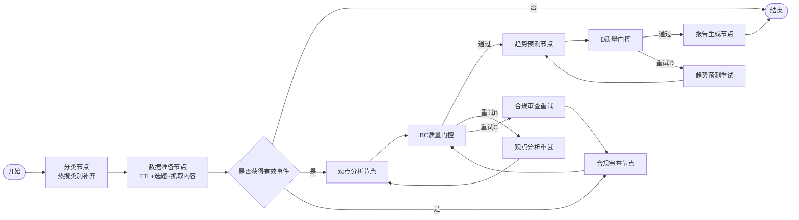

# 第四章 社交网络内容安全审核与报告生成系统详细设计

## 4.1 本章概述

上一章已从总体层面对系统的分层架构、核心模块及协作关系进行了概要设计。本章在此基础上，进一步面向实际实现过程展开详细设计，重点说明系统在工作流组织、数据库结构、模块内部处理逻辑、提示词工程、接口交互与报告组装等方面的具体实现方案。与概要设计侧重“做什么”不同，本章更强调“如何做”，即说明各模块如何在现有技术栈下形成可执行、可追溯、可扩展的实现机制。

结合项目当前实现，本章仍然遵循概要设计中的层与模块展开，但在章节顺序上将数据库结构设计前置于各功能模块之前。这是因为本系统属于典型的数据驱动型智能分析系统，各模块之间的输入输出均建立在热搜快照、帖子评论、法规条款和状态快照等数据结构之上。先交代底层数据组织方式，能够使后续模块设计中的字段来源、状态流转和证据链结构更具逻辑完整性。

## 4.2 工作流调度与运行状态详细设计

### 4.2.1 多智能体协作流程细化

在概要设计中，系统第二层被定义为基于 LangGraph 的多智能体协作工作流。当前实现沿用了这一思路，并进一步将业务流程细化为“分类预处理、数据准备、并行分析、质量门控、趋势预测、报告生成”六个阶段。其真实执行顺序如图 4-1 所示。



图 4-1 系统多智能体工作流执行图

该流程与概要设计中的核心思路保持一致，即数据准备完成后，观点分析与合规审查并行执行，二者汇合后再进入风险预测和报告生成阶段。与概要层描述相比，详细设计进一步引入了分类前置节点和双层质量门控机制，从而使工作流在面向真实工程运行时具备更强的稳健性。

### 4.2.2 状态对象设计

系统工作流以统一状态对象作为各节点之间的数据传递载体。状态对象记录任务参数、中间结果、质量评分与最终产物，避免模块间通过零散临时变量耦合。其核心字段包括任务编号、分析时间范围、分析类别、核心事件列表、舆情分析结果、合规审查结果、趋势预测结果、最终报告内容以及质量门控反馈等。

这种统一状态设计具有三方面价值。首先，它为多节点协作提供了清晰的数据边界，各模块只需读取所依赖字段并写入各自产物即可。其次，它提高了流程可追踪性，任一时刻均可通过状态快照判断任务执行到了哪个阶段、产生了哪些中间结果。最后，它为断点续传提供了前提，使工作流能够在中断后从最近一次有效状态恢复。

### 4.2.3 断点续传与状态持久化

考虑到系统涉及多个大模型调用步骤，任务执行时间较长，一旦运行中断，若完全从头执行将造成较大时间开销。因此，系统在详细实现中引入 SQLite 检查点机制，将工作流每个阶段的状态快照自动持久化到本地数据库中。运行时以任务 `thread_id` 作为唯一标识，当同一任务再次启动时，系统优先读取历史快照并恢复状态，而不是重新初始化。

这一设计不仅提高了系统的鲁棒性，也有利于论文中的可复现实验。研究者可以在固定任务编号下复现实验过程，比较重试前后同一阶段输出的差异，从而增强系统的实验可解释性。

## 4.3 数据库与存储结构详细设计

### 4.3.1 存储体系设计思路

本系统采用文档数据库、向量数据库与轻量级状态数据库相结合的混合存储方案。其中，MongoDB 用于存储业务数据，ChromaDB 用于存储法规向量知识，SQLite 用于持久化工作流状态快照。三类存储分别服务于“原始数据管理”“规则知识支撑”和“运行态恢复”三种不同需求，在逻辑上相互解耦但在业务上相互协同。

### 4.3.2 MongoDB 业务数据结构设计

MongoDB 是系统的数据主仓库，负责保存热搜快照、帖子内容、评论内容、核心事件和报告会话统计。其主要集合设计如表 4-1 所示。

表 4-1 MongoDB 主要集合结构设计

| 集合名称 | 关键字段 | 作用 |
| --- | --- | --- |
| `hot_trends_history` | `source`、`collected_at`、`top_n` | 存储微博热搜榜快照 |
| `weibo_contents` | `note_id`、`source_keyword`、`content`、`liked_count`、`audit_status` | 存储原始帖子及审核状态 |
| `weibo_comments` | `note_id`、`comment_id`、`content`、`comment_like_count`、`audit_status` | 存储评论及评论审核状态 |
| `events` | `event_name`、`related_keywords`、`total_heat`、`category` | 存储预处理后的核心事件 |
| `report_sessions` | `task_id`、`category`、`violation_stats`、`created_at` | 存储报告级统计信息 |

其中，`hot_trends_history` 采用“快照 + 榜单项数组”的嵌套结构设计。该设计能够完整保留某一时间点的榜单状态，适合按时间回溯热点全貌。与此同时，系统在预处理时会将 `top_n` 字段炸开为词条级记录，以适配后续热度计算和类别筛选操作。

### 4.3.3 向量知识库结构设计

合规审查模块需要对违规文本与平台规则之间建立语义匹配关系。为此，系统使用 ChromaDB 构建法规向量知识库，并以 `weibo_audit_rules` 作为规则集合。知识条目通常由条款文本及其元数据组成，元数据中包含违规类别、条款编号和风险等级等信息。系统在检索时可结合类别过滤条件，仅在指定类别内进行语义搜索，从而提高命中精度。

表 4-2 向量知识条目结构

| 字段 | 含义 |
| --- | --- |
| 条款文本 | 用于生成向量的法规或社区规则原文 |
| 违规类别 | 条款所属违规分类 |
| 条款编号 | 具体规则编号或章节标识 |
| 风险等级 | 该规则对应的风险严重程度 |

### 4.3.4 运行状态存储设计

与 MongoDB 和 ChromaDB 不同，SQLite 并不直接存储业务分析数据，而是承担工作流检查点的持久化任务。通过该机制，系统可以在每个节点执行结束后自动记录状态快照，并在后续恢复时快速加载。这种设计方式非常适合毕业设计场景中的单机实验环境：一方面部署简单，另一方面可满足长流程任务的可恢复需求。

### 4.3.5 数据库设计与模块设计的关系

将数据库设计前置后，可以清晰地看到后续模块设计的输入输出边界。例如，数据采集模块从 `hot_trends_history` 中读取热搜快照；舆情分析模块从 `weibo_contents` 与 `weibo_comments` 中获取帖子和评论样本；合规审查模块从 ChromaDB 中检索法规条款并将审查结果回写 MongoDB；工作流调度层则通过 SQLite 管理状态快照。这种结构化的依赖关系有助于增强整章论述的专业性与完整性。

## 4.4 数据采集与预处理模块详细设计

### 4.4.1 模块功能定位

数据采集与预处理模块是整个工作流的起点，其目标是从原始热搜快照中提取当前分析任务所需的核心事件，并为下游模块准备帖子与评论数据。在概要设计中，该模块被描述为承担原始数据获取、清洗、筛选与事件归并。本章进一步结合当前实现说明其内部处理流程。

### 4.4.2 原始数据采集流程

系统首先根据用户输入的时间范围读取热搜快照集合，并对日期字符串进行边界规范化处理。对于只输入日期而未指定时分秒的情况，系统自动将开始时间补齐为当天 00:00:00，将结束时间补齐为当天 23:59:59，以保证查询窗口覆盖完整业务时段。

在类别筛选方面，系统当前实现支持七类标签：综合、社会、高校、生活、科技、政治和其他。其中“其他”作为兜底类别，用于承接无法准确归入既有类别的词条。该设计在理论上略扩展于需求分析中提出的六类标签，但在工程实现上有助于降低强制分类带来的误差。

### 4.4.3 分类补齐机制

当用户指定具体类别而非“综合”时，系统会先执行分类补齐节点。该节点从热搜快照中提取所有唯一词条，读取已有分类标签，对未分类词条调用大模型并行补全其类别信息，最后将结果回写至原始快照数据中。这样，后续 ETL 阶段便可直接依据类别字段进行筛选，而不需要在每次任务执行时重复分类。

### 4.4.4 数据清洗与热度聚合算法

当前版本的预处理模块采用“精确匹配词条后累加热度”的实现策略，即仅当两个热搜词条完全相同时，才将其热度值累加到同一统计项中。该方案较概要设计中提及的语义归并更为保守，但具有两个明显优点：一是可解释性强，热度聚合规则明确且易于复核；二是工程稳定性高，不依赖额外大模型调用即可完成事件筛选。

算法 4-1 给出了当前预处理模块的核心逻辑。

```text
算法 4-1  热搜事件热度聚合算法
输入：时间范围内的热搜词条集合 R，类别筛选条件 C
输出：核心事件列表 E

1: 初始化空映射 M
2: for each item in R do
3:     if C 为具体类别且 item.category != C then
4:         continue
5:     end if
6:     word <- item.word
7:     heat <- item.num
8:     M[word] <- M[word] + heat
9: end for
10: 将 M 按热度降序排序
11: 取前 20 项构造事件对象
12: 写入 events 集合并返回
```

### 4.4.5 帖子与评论抓取策略

在得到候选核心事件后，系统会进一步为前 20 个事件抓取高热帖子和高赞评论。当前实现中，每个事件最多抓取 15 条帖子，每条帖子最多抓取 200 条评论。抓取时优先按点赞数进行排序，从而保证输入数据尽可能代表舆论场中的主流讨论样本。与此同时，帖子中的图片链接和视频链接也会被抽取并拼装为媒体语境文本，用于后续观点分析和合规审核过程中的上下文补充。

### 4.4.6 模块输出

本模块最终输出核心事件列表，每条事件至少包含事件名、相关关键词、累计热度、类别和时间戳。对已抓取内容的事件，还会额外附加帖子列表，供舆情观点分析和合规审查模块并行使用。

## 4.5 舆情观点分析模块详细设计

### 4.5.1 模块功能定位

舆情观点分析模块承接预处理后的核心事件列表，面向单个热点事件生成“事实背景 + 观点结构 + 深度评论”三位一体的分析结果。该模块的实现重点在于利用 Map-Reduce 范式对多帖子评论文本进行分治处理，从而规避长文本直接输入大模型所带来的上下文压力。

### 4.5.2 事实背景检索

在正式执行观点聚类之前，系统首先调用联网搜索工具检索事件背景信息，并优先获取事件详情、官方通报和权威媒体报道。检索得到的结果并不直接作为最终报告内容，而是作为事实锚点注入后续 Reduce 阶段，用于帮助模型区分客观事实与评论态度，减少误判和主观臆断。

### 4.5.3 单帖观点聚类设计

Map 阶段以帖子为分析单位，并行处理该帖子下的评论集合。对于每条帖子，系统将主贴正文、媒体语境和评论样本统一注入提示词，由大模型输出观点簇结构与评论区冲突分析。输出中重点保留观点阵营、情绪倾向与大致占比三个维度，以便后续跨帖归约。

表 4-3 单帖观点聚类输出结构

| 输出字段 | 含义 |
| --- | --- |
| 观点阵营 | 当前帖子评论区的主要观点集合 |
| 情绪倾向 | 对应阵营的主导情绪标签 |
| 占比估计 | 该阵营在评论样本中的大致比例 |
| 对立分析 | 评论区冲突程度与矛盾点概括 |

### 4.5.4 事件级归约设计

Reduce 阶段负责对多个帖子级观点切片进行汇总，并生成事件级深度研判内容。最终输出包含三部分：其一为事件概述，用于还原事实经过；其二为舆论观点，用于梳理主流声浪、次生质疑、深层情绪及对立博弈；其三为深度分析，用于给出超越事实复述的社会学或传播学解释。

### 4.5.5 事件去重与质量门控

由于热点榜单中可能存在描述同一事件的不同词条，模块在正式分析前会先调用事件去重判断逻辑，跳过已分析的重复事件。分析完成后，系统还会将结果送入 BC 质量门控模块，重点检查其是否覆盖足够数量的独立事件、是否基于真实评论归纳观点，以及是否体现出足够的分析层次。如果质量不达标，系统将改进反馈注入重试提示词，再重新生成分析结果。

## 4.6 合规审查与违规检测模块详细设计

### 4.6.1 模块功能定位

合规审查模块与舆情观点分析模块并行运行，面向帖子及其评论完成违规识别、法规匹配和证据链生成。与一般情感分析或关键词过滤不同，本模块强调“事实依据 + 规则依据”的双重约束，即不仅要指出违规文本，还要给出与之匹配的法规或平台条款。

### 4.6.2 审核知识库设计

系统将微博社区规则及相关审核细则解析为条款级知识单元，并存入向量知识库。每个条款除原文外，还附带违规类别和风险等级等结构化信息。这样，在审查过程中，系统既能通过语义相似度检索命中相关规则，又能按照类别过滤提升检索的准确性。

### 4.6.3 批量审查机制

当前实现采用“主贴 + 评论列表”的批量审查模式，而不是逐条评论单独调用模型。该模式的核心优势在于能够在单次推理中保留上下文完整性，减少调用次数，并便于统一判断主贴与评论之间的风险联系。模型首先输出主贴是否违规以及哪些评论被判定为违规，并为每一条违规评论给出原文摘录、违规类别和判定理由。

### 4.6.4 法规检索与 HyDE 增强

在得到违规类别和文本片段之后，系统并不会直接将结果作为最终判定输出，而是进一步调用向量知识库进行法规检索。由于违规原文往往带有口语化甚至情绪化表达，与法规条文的正式表述存在较大差异，因此系统引入 HyDE 检索策略：先根据违规内容生成一段更接近法规表述风格的“假设性条款文本”，再用该文本进行向量检索。该方法能够提高规则匹配的语义精度。

### 4.6.5 证据链与处置建议生成

当违规文本与规则条款完成匹配后，系统进入证据链生成阶段。证据链中既包含具体的违规片段，也包含对应条款及其适用原因，并进一步给出处置建议，如删除内容、限制功能或上报监管等。由于证据链本身需要用于报告呈现和后续复核，因此系统采用结构化格式对其进行输出，而不是仅生成自然语言说明。

### 4.6.6 审核结果回写

审核结果最终会被写回帖子和评论集合，形成持久化的审核痕迹。这样做有助于两个方面：一方面，后续仪表盘可以直接利用这些结果进行统计；另一方面，若重新生成报告，系统也可以复用已完成的审查结果，避免重复计算。

## 4.7 趋势预测与风险研判模块详细设计

### 4.7.1 模块功能定位

趋势预测模块用于在当前舆情研判的基础上，对未来一周、半月、一月或两月内的潜在风险主题进行前瞻性推演。其目标不是简单延长事实陈述，而是将历史规律、未来情报和当前舆情情绪综合起来，形成面向未来的结构化风险预警。

### 4.7.2 输入组织方式

为了避免模型直接面对过于分散的原始数据，系统在本模块中采用“结构化摘要输入”的设计。具体而言，输入主要由四部分组成：当前舆情分析摘要、已核实的违规风险摘要、历史规律文本和未来情报文本。相比直接输入原始帖子评论，这种方式更有利于模型聚焦于风险模式本身。

### 4.7.3 推演框架设计

系统在提示词中预置了风险推演框架，要求模型围绕未来时间窗口中必然发生的重要时间节点、已知政策安排、周期性社会事件等因素展开推理。推理结果需要回答三个问题：未来什么场景可能触发舆情、风险将沿何种路径扩散、应采取何种前置应对措施。通过这一框架，模型生成的预测结果能够避免停留在抽象判断层面。

### 4.7.4 输出结构设计

预测结果采用严格结构化格式，至少包括目标预测时段、宏观依据来源列表以及若干风险预测主题。每个主题均需进一步拆解为背景说明、具体风险点、发生概率和证据依据。这里的“证据依据”被明确要求来自历史规律或未来情报，而不能只从当前情绪中推断，这一点也是质量门控的重要检查点。

### 4.7.5 质量控制机制

趋势预测模块的质量控制包括提示词内部自检和外部质量门控两层。提示词内部自检要求模型在生成前核查主题数量、证据充分性与视角独立性；外部质量门控则从输出结果中进一步检验是否生成了足够数量的主题、是否引用了有效依据、是否包含风险场景与应对建议。若不满足要求，系统会将反馈重新注入提示词并进行有限次重试。

## 4.8 智能报告生成模块详细设计

### 4.8.1 模块功能定位

报告生成模块位于工作流末端，负责将核心事件榜单、深度分析结果、合规审查证据链和趋势预测内容统一组装为标准化研判报告。与前序模块侧重分析不同，该模块的重点在于信息整合、章节编排与文本表达。

### 4.8.2 报告章节组织方式

系统当前生成的研判报告采用 Markdown 作为承载格式，整体包含前言摘要、热点榜单、重点事件深读、趋势预测与合规审查附录等部分。这一章节结构与概要设计中给出的报告框架保持一致，同时又便于前端渲染、导出和后续编辑。

### 4.8.3 前言生成机制

在报告所有章节中，前言部分是唯一需要大模型进行综合性写作的部分。系统先根据热点榜单、深度分析摘要、违规统计和趋势预测结果计算一组统计锚点，再将这些锚点与摘要信息一并注入前言提示词，由模型输出结构化前言对象。通过这种方式，系统可以在保持前言语言凝练性的同时，降低模型杜撰数量信息的风险。

### 4.8.4 模板组装与文件输出

其余章节主要采用模板填充方式生成。例如，热点榜单章节直接根据核心事件列表渲染，深读章节直接映射舆情分析结果，趋势预测章节直接映射预测主题，合规附录则根据审查结果和证据链进行表格化汇总。最终报告文件按照“舆情研判_类别_时间”命名规则保存为 Markdown 文件，便于后续通过前端在线查看与下载。

## 4.9 人机交互与可视化模块详细设计

### 4.9.1 前端结构设计

前端采用基于 Vue 的组件化开发方式，通过路由机制组织驾驶舱、任务管理、历史报告、报告详情、系统日志和系统设置等视图。全局状态由 Pinia 管理，用于维护当前任务、仪表盘统计、系统设置和主题配置等数据。

### 4.9.2 任务控制台交互设计

任务控制台负责完成任务配置、发起与执行监控。用户在界面中选择分析类别、起止日期和预测周期后，前端将参数封装为标准请求对象发送给后端。任务执行后，界面通过轮询持续获取任务状态，并同步刷新当前步骤、总体进度和任务耗时。为了增强流程透明性，界面还使用流程节点可视化方式呈现各处理阶段的执行状态。

### 4.9.3 驾驶舱与报告详情设计

驾驶舱页面以统计卡片、柱状图、饼图和报告列表等形式呈现历史报告总量、类别分布和高频违规类别分布，从而为审核人员提供整体态势感知。报告详情页则通过 Markdown 渲染方式展示完整研判报告，并支持在线查看、下载与复制内容。对于表格中的长文本内容，界面还提供点击弹窗查看完整信息的交互设计，以提高可读性。

### 4.9.4 日志与设置功能设计

系统日志页面通过 WebSocket 实时接收后端广播的运行日志，便于用户观察任务执行细节与异常信息。系统设置页面则允许用户调整后端接口地址、大模型接入参数等运行配置，并支持在线测试模型连接状态，从而增强系统在不同部署环境下的适应能力。

## 4.10 提示词与结构化输出设计

### 4.10.1 提示词工程设计原则

为了保证大模型在复杂业务场景中的输出稳定性，系统在详细实现中将提示词工程作为独立设计内容加以组织。其设计原则主要包括：角色清晰、输入边界明确、输出结构严格和自检约束充分。每个核心模块都被赋予与其业务角色相匹配的专家身份，例如舆情分析专家、内容安全分类器、战略预警专家和报告总编等。

### 4.10.2 提示词设计映射表

表 4-4 核心提示词设计映射

| 模块 | 角色设定 | 输入内容 | 输出结构 |
| --- | --- | --- | --- |
| 观点分析 Map | 舆情微观分析师 | 主贴、媒体语境、评论样本 | 单帖观点聚类结果 |
| 观点分析 Reduce | 智库社会学专家 | 背景事实、多个舆情切片 | 事件级深度报告 |
| 合规审查 | 内容安全分类器 | 主贴、评论、违规类别集合 | 批量违规识别结果 |
| 证据链生成 | 合规数据库录入员 | 违规项与命中法规 | 合规证据链报告 |
| 趋势预测 | 战略预警专家 | 历史规律、未来情报、当前态势 | 结构化预测报告 |
| 前言生成 | 报告总编 | 统计锚点、摘要信息 | 结构化前言 |

### 4.10.3 结构化输出设计价值

系统在多个模块中通过 Pydantic Schema 对模型输出进行约束，这一设计直接提升了模块协作的稳定性。首先，结构化输出使每个模块都能明确知道上游结果有哪些字段，避免自然语言结果在下游解析时产生歧义。其次，字段校验机制能够提前暴露空值、字段缺失和类型不一致等问题。最后，结构化对象还可以直接用于数据库回写、报告模板填充和前端渲染，降低重复转换成本。

## 4.11 本章小结

本章在概要设计的基础上，对系统的工作流调度、数据库结构、数据采集与预处理、舆情观点分析、合规审查、趋势预测、报告生成、人机交互以及提示词工程等内容进行了详细设计。与上一章相比，本章更加侧重真实实现层面的细节，明确了各模块的内部处理逻辑、输入输出结构与数据依赖关系。通过这些设计，系统不仅形成了从任务提交到报告输出的完整闭环，也在结构化输出、状态持久化、证据链构建和多模块协同方面体现出较强的工程可行性，为后续的系统实现与实验验证奠定了坚实基础。