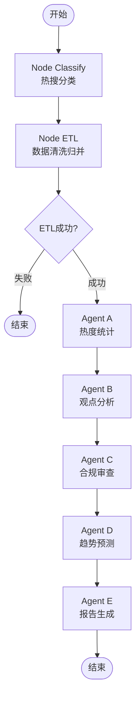

# 舆情研判系统 (Public Opinion Analysis System)

基于 LangGraph + 多智能体协作的社交媒体舆情分析与研判报告生成系统

## 📋 目录

- [系统概述](#系统概述)
- [技术架构](#技术架构)
- [核心Pipeline流程](#核心pipeline流程)
- [目录结构](#目录结构)
- [快速开始](#快速开始)
- [配置说明](#配置说明)
- [核心模块详解](#核心模块详解)
- [API文档](#api文档)
- [前端说明](#前端说明)
- [常见问题](#常见问题)

---

## 系统概述

本系统是一个自动化的舆情分析平台，能够从微博等社交媒体平台采集热搜数据，通过5个专业AI Agent协同工作，生成专业的舆情研判报告。

### 主要功能

- 🔍 **热搜数据采集**: 自动采集微博热搜榜数据
- 🏷️ **智能分类**: 对热搜词条进行7类别自动分类
- 📊 **热度统计**: 分析事件热度趋势和排名
- 💬 **观点分析**: 深度分析公众舆论观点和情绪
- ⚖️ **合规审查**: 基于法规进行内容合规性审查
- 🔮 **趋势预测**: 预测未来舆情发展趋势
- 📝 **报告生成**: 自动生成PDF格式研判报告

### 技术亮点

- **LangGraph工作流**: 基于状态机的多阶段处理pipeline
- **多智能体协作**: 5个专业Agent各司其职
- **结构化输出**: 使用Pydantic约束LLM输出格式
- **RAG检索增强**: 基于向量数据库的合规审查
- **断点续传**: 支持任务中断后继续执行
- **实时进度**: WebSocket推送任务执行进度

---

## 技术架构

### 整体架构图

```
┌─────────────────────────────────────────────────────────┐
│                     前端 (Vue 3)                        │
│  ┌──────────┐ ┌──────────┐ ┌──────────┐ ┌──────────┐   │
│  │Dashboard │ │  Task    │ │ Reports  │ │ Settings │   │
│  └──────────┘ └──────────┘ └──────────┘ └──────────┘   │
└──────────────────────┬──────────────────────────────────┘
                       │ HTTP + WebSocket
                       ▼
┌─────────────────────────────────────────────────────────┐
│              后端 API (FastAPI + Python)                │
└──────────────────────┬──────────────────────────────────┘
                       │
                       ▼
┌─────────────────────────────────────────────────────────┐
│           LangGraph 工作流引擎                          │
│  ┌─────────────────────────────────────────────────┐   │
│  │  Start → Classify → ETL → A/B/C/D/E → End      │   │
│  └─────────────────────────────────────────────────┘   │
└──────────────────────┬──────────────────────────────────┘
                       │
        ┌──────────────┼──────────────┐
        ▼              ▼              ▼
  ┌─────────┐   ┌──────────┐   ┌──────────┐
  │ MongoDB │   │ChromaDB  │   │ SQLite   │
  │热搜数据  │   │合规规则  │   │状态持久化  │
  └─────────┘   └──────────┘   └──────────┘
        │
        ▼
┌─────────────────────────────────────────┐
│        LLM (GPT-4o-mini)                │
│  OpenAI-compatible API                  │
└─────────────────────────────────────────┘
```

### 技术栈

#### 后端
- **Python 3.11+**
- **FastAPI** - Web框架
- **LangGraph** - 工作流编排
- **LangChain** - LLM应用框架
- **Pydantic** - 数据验证
- **MongoDB** - 热搜数据存储
- **ChromaDB** - 向量数据库
- **SQLite** - 状态持久化
- **OpenAI API** - LLM服务

#### 前端
- **Vue 3** - 前端框架
- **Vite** - 构建工具
- **Pinia** - 状态管理
- **Element Plus** - UI组件库
- **ECharts** - 数据可视化
- **Axios** - HTTP客户端

---

## 核心Pipeline流程

### 6阶段处理流程



### 详细说明

#### 阶段1: Node Classify (热搜分类)

**文件**: `Backend/app/agents/nodes.py::classify_node`

**功能**:
- 对原始热搜词条进行分类标注
- 支持7个类别: 社会、高校、生活、科技、政治、其他、综合
- 使用LLM并行处理,提高效率
- 避免重复分类已有标签的词条

**输入**:
```python
{
    "category": "综合",  # 用户选择的类别
    "start_date": "2026-01-01",
    "end_date": "2026-01-19"
}
```

**输出**:
```python
{
    "current_step": "Classify_Completed"
}
```

#### 阶段2: Node ETL (数据清洗与归并)

**文件**: `Backend/app/etl/event_manager.py` + `Backend/app/agents/nodes.py::etl_node`

**功能**:
- 从MongoDB读取指定时间范围的热搜数据
- 精确匹配累加相同词条的热度值
- 支持按用户选择的类别筛选
- 返回Top 20热点事件

**处理逻辑**:
```python
# 1. 捞取原始热搜数据
raw_items = mongo_db.get_raw_trend_items(start_date, end_date)

# 2. 精确匹配累加热度
word_heat_map = {}
for item in raw_items:
    word = item["word"]
    heat = item["num"]
    word_heat_map[word] += heat

# 3. 排序并取Top 20
sorted_items = sorted(word_heat_map.items(), key=lambda x: x[1], reverse=True)[:20]
```

**输出**:
```python
[
    {
        "event_name": "某事件",
        "total_heat": 1234567,
        "category": "社会",
        "created_at": "2026-01-19 12:00:00"
    },
    ...
]
```

#### 阶段3: Agent A (热度统计)

**文件**: `Backend/app/agents/agent_stats.py`

**功能**:
- 从MongoDB获取ETL处理后的核心事件
- 按热度排序并筛选Top 50
- 格式化数据供下游Agent使用

**代码示例**:
```python
def agent_stats(self, top_n: int = 50):
    events = mongo_db.get_core_events()
    sorted_events = sorted(events, key=lambda x: x["total_heat"], reverse=True)
    return sorted_events[:top_n]
```

#### 阶段4: Agent B (观点分析)

**文件**: `Backend/app/agents/agent_opinions.py`

**功能**:
- **Map阶段**: 对每个事件的Top 15热门帖子进行观点聚类分析
- **Reduce阶段**: 综合所有帖子分析,生成事件深度报告
- 使用LLM去重确保分析5个不同事件
- 每个事件分析200条评论

**处理流程**:
```python
# 1. Map: 并发分析多个帖子
with ThreadPoolExecutor(max_workers=8) as executor:
    futures = [executor.submit(analyze_post, post) for post in posts]
    results = [f.result() for f in futures]

# 2. Reduce: 综合分析
final_report = reduce_analyses(event_name, results)
```

**Schema定义**:
```python
class OpinionCluster(BaseModel):
    viewpoint: str  # 核心观点
    emotion: str  # 情绪(不满/愤怒/支持等)
    estimated_ratio: str  # 占比(约60%)

class PostOpinionSummary(BaseModel):
    opinion_clusters: List[OpinionCluster]
    conflict_analysis: str  # 舆论对立分析

class EventAnalysisReport(BaseModel):
    event_overview: str  # 事件概况
    public_opinions: List[dict]  # 公众观点
    depth_analysis: str  # 深度分析
```

#### 阶段5: Agent C (合规审查)

**文件**: `Backend/app/agents/agent_compliance.py`

**功能**:
- 基于微博投诉细则进行合规审查
- 使用RAG从ChromaDB检索相关法规
- 批量审核帖子和评论
- 生成违规统计报告

**RAG检索流程**:
```python
# 1. 向量化查询
query_embedding = embed_model.embed_query(comment_text)

# 2. 检索相关法规
related_laws = chroma_db.search_related_laws(
    query=comment_text,
    top_k=3,
    category_filter=violation_category
)

# 3. LLM审核
audit_result = llm.invoke(
    f"基于以下法规审核该内容:\n{laws}\n\n内容:\n{comment}"
)
```

**输出Schema**:
```python
class AuditAnalysis(BaseModel):
    is_compliant: bool
    risk_level: Literal["高", "中", "低"]
    violated_articles: List[str]  # 违反的条款
    evidence: str  # 违规证据
```

#### 阶段6: Agent D (趋势预测)

**文件**: `Backend/app/agents/agent_forecast.py`

**功能**:
- 基于历史数据和未来情报预测舆情趋势
- 支持1周/2周/1个月/2个月预测范围
- 考虑时间特殊性和历史规律
- 生成风险预警和应对建议

**预测逻辑**:
```python
# 1. 确定预测周期
forecast_range = state.get("forecast_range", "1m")
end_date = now + relativedelta(months=1)

# 2. 搜索历史同期案例
history_query = f"历年{now.month}月舆情高发事件"
history_context = search_tool.invoke(history_query)

# 3. 搜索未来风险点
future_query = f"{now.year}年{now.month}月政策日历"
future_context = search_tool.invoke(future_query)

# 4. LLM研判
forecast_report = llm.invoke(
    prompt=FORECAST_TEMPLATE,
    input={
        "history": history_context,
        "future": future_context,
        "current_events": analyzed_events
    }
)
```

#### 阶段7: Agent E (报告生成)

**文件**: `Backend/app/agents/agent_report.py`

**功能**:
- 整合所有Agent的分析结果
- 生成结构化的Markdown报告
- 转换为PDF格式并保存

**报告结构**:
```markdown
# {category}舆情研判报告

## 一、研判概述
- 时间范围
- 数据来源
- 核心发现

## 二、热点事件排名
### Top 1: {事件名}
- 热度指数
- 类别归属
- 时间分布

## 三、深度观点分析
### 事件一: {事件名}
#### 事件概况
...

#### 舆论观点
- 观点1 (约60%): ...
- 观点2 (约30%): ...

#### 深度分析
...

## 四、合规风险评估
### 违规统计
- 总违规帖数: X
- 高风险事件: Y

### 违规分布
| 违规类别 | 次数 |
|---------|------|
| 色情低俗 | 10 |
| 虚假信息 | 5 |

## 五、趋势预测与风险预警
### 议题一: {议题}
#### 风险描述
...
#### 应对建议
...

## 六、总结与建议
```

---

## 目录结构

```
graduation-project/
├── Backend/                    # 后端目录
│   ├── app/
│   │   ├── agents/            # AI智能体
│   │   │   ├── agent_stats.py      # Agent A: 热度统计
│   │   │   ├── agent_opinions.py   # Agent B: 观点分析
│   │   │   ├── agent_compliance.py # Agent C: 合规审查
│   │   │   ├── agent_forecast.py   # Agent D: 趋势预测
│   │   │   ├── agent_report.py     # Agent E: 报告生成
│   │   │   ├── nodes.py            # LangGraph节点定义
│   │   │   ├── state.py            # 状态管理
│   │   │   ├── tools.py            # 工具函数
│   │   │   └── workflow.py         # 工作流定义
│   │   ├── api/                # FastAPI接口
│   │   │   └── main.py            # API路由
│   │   ├── core/               # 核心配置
│   │   │   ├── config.py          # 全局配置
│   │   │   ├── prompts.py         # Prompt模板库
│   │   │   ├── schemas.py         # Pydantic数据模型
│   │   │   └── logger.py          # 日志配置
│   │   ├── db/                 # 数据库层
│   │   │   ├── mongo_manager.py   # MongoDB管理
│   │   │   ├── chroma_manager.py  # ChromaDB管理
│   │   │   └── checkpointer.py    # SQLite状态持久化
│   │   ├── etl/                # ETL处理
│   │   │   └── event_manager.py   # 事件归并管理
│   │   └── services/           # 服务层
│   │       └── category_classifier.py  # 分类服务
│   ├── main.py                 # 命令行入口
│   └── requirements.txt        # Python依赖
│
├── Frontend/                   # 前端目录
│   ├── src/
│   │   ├── views/             # 页面组件
│   │   │   ├── Dashboard.vue     # 数据驾驶舱
│   │   │   ├── Task.vue          # 任务管理
│   │   │   ├── Reports.vue       # 历史报告
│   │   │   ├── ReportDetail.vue  # 报告详情
│   │   │   ├── Logs.vue          # 系统日志
│   │   │   └── Settings.vue      # 系统设置
│   │   ├── components/        # 通用组件
│   │   ├── stores/            # Pinia状态管理
│   │   │   └── app.js            # 全局store
│   │   ├── api/              # API封装
│   │   │   └── index.js          # API客户端
│   │   ├── router/           # 路由配置
│   │   ├── assets/           # 静态资源
│   │   ├── App.vue           # 根组件
│   │   └── main.js           # 入口文件
│   ├── index.html
│   ├── vite.config.js        # Vite配置
│   └── package.json          # NPM依赖
│
├── MediaCrawler/              # 爬虫模块
│   └── ...
│
├── output/                    # 输出目录
│   └── *.md                  # 生成的报告文件
│
└── readme.md                 # 本文件
```

---

## 快速开始

### 环境要求

- Python 3.11+
- Node.js 18+
- MongoDB 5.0+
- OpenAI API密钥

### 后端安装

```bash
# 1. 进入后端目录
cd Backend

# 2. 创建虚拟环境
python -m venv .venv

# 3. 激活虚拟环境
# Windows:
.venv\Scripts\activate
# Linux/Mac:
source .venv/bin/activate

# 4. 安装依赖
pip install -r requirements.txt

# 5. 配置环境变量
cp .env.example .env
# 编辑.env文件,填入API密钥和数据库配置

# 6. 初始化合规规则库
python app/scripts/init_weibo_rules.py

# 7. 启动后端服务
python -m uvicorn app.api.main:app --reload --host 0.0.0.0 --port 8000
```

### 前端安装

```bash
# 1. 进入前端目录
cd Frontend

# 2. 安装依赖
npm install

# 3. 启动开发服务器
npm run dev
```

### 访问应用

- 前端地址: http://localhost:5173
- 后端API: http://localhost:8000
- API文档: http://localhost:8000/docs

---

## 配置说明

### 后端配置 (Backend/.env)

```env
# LLM配置
ZHIPU_API_KEY=your_api_key_here
LLM_MODEL=gpt-4o-mini
LLM_BASE_URL=https://api.openai.com/v1

# MongoDB配置
MONGO_URI=mongodb://localhost:27017
MONGO_DB_NAME=media_crawler_db

# ChromaDB配置
CHROMA_DB_PATH=./chroma_db

# Tavily搜索配置(可选)
TAVILY_API_KEY=your_tavily_key

# 调试开关
FORCE_AUDIT_UPDATE=True
```

### 前端配置

前端配置通过UI界面设置,保存在localStorage中:
- 后端API地址
- 主题偏好
- 语言设置

---

## 核心模块详解

### 1. LangGraph工作流

**文件**: `Backend/app/agents/workflow.py`

LangGraph使用状态机模式管理整个pipeline:

```python
from langgraph.graph import StateGraph, END

# 创建状态图
workflow = StateGraph(GraphState)

# 添加节点
workflow.add_node("classify", classify_node)
workflow.add_node("etl", etl_node)
workflow.add_node("agent_a", agent_a_node)
workflow.add_node("agent_b", agent_b_node)
workflow.add_node("agent_c", agent_c_node)
workflow.add_node("agent_d", agent_d_node)
workflow.add_node("agent_e", agent_e_node)

# 设置边
workflow.add_edge("classify", "etl")
workflow.add_conditional_edges(
    "etl",
    should_continue,
    {
        "continue": "agent_a",
        "end": END
    }
)
workflow.add_edge("agent_a", "agent_b")
workflow.add_edge("agent_b", "agent_c")
workflow.add_edge("agent_c", "agent_d")
workflow.add_edge("agent_d", "agent_e")
workflow.add_edge("agent_e", END)

# 编译
app = workflow.compile()
```

### 2. 状态管理

**文件**: `Backend/app/agents/state.py`

使用TypedDict定义状态结构:

```python
class GraphState(TypedDict):
    task_id: str
    user_query: str
    start_date: Optional[str]
    end_date: Optional[str]
    forecast_range: str  # 1w/2w/1m/2m
    category: str  # 综合或具体类别

    # 中间状态
    messages: List[str]
    core_events: List[Dict]  # Agent A输出
    analyzed_events: List[Dict]  # Agent B输出
    audit_results: List[Dict]  # Agent C输出
    trend_forecast: Dict  # Agent D输出
    final_report: str  # Agent E输出

    error: str
    current_step: str
```

### 3. 结构化输出

**文件**: `Backend/app/core/schemas.py`

所有Agent使用Pydantic约束LLM输出:

```python
from pydantic import BaseModel, Field

class OpinionCluster(BaseModel):
    """观点簇"""
    viewpoint: str = Field(description="核心观点")
    emotion: str = Field(description="情绪")
    estimated_ratio: str = Field(description="占比")

# 使用
structured_llm = llm.with_structured_output(OpinionCluster)
result = structured_llm.invoke("分析以下评论...")
```

### 4. RAG检索

**文件**: `Backend/app/db/chroma_manager.py`

使用ChromaDB存储和检索法规:

```python
# 初始化
chroma_db = ChromaManager()

# 添加规则
chroma_db.add_rules(rules_data)

# 检索
results = chroma_db.search_related_laws(
    query="发布色情内容",
    top_k=3,
    category_filter="违法信息-色情"
)
```

---

## API文档

### 创建任务

```http
POST /api/tasks
Content-Type: application/json

{
    "start_date": "2026-01-01",
    "end_date": "2026-01-19",
    "category": "综合",
    "forecast_range": "1m"
}
```

**响应**:
```json
{
    "task_id": "task_20260119_1205",
    "status": "running",
    "progress": 0,
    "current_step": "初始化",
    "message": "任务已创建",
    "start_time": 1737259500000
}
```

### 查询任务状态

```http
GET /api/tasks/{task_id}
```

**响应**:
```json
{
    "task_id": "task_20260119_1205",
    "status": "running",
    "progress": 65,
    "current_step": "合规审查",
    "message": "Agent C 正在进行合规性审查...",
    "start_time": 1737259500000
}
```

### 获取报告列表

```http
GET /api/reports?category=综合
```

### 下载报告

```http
GET /api/reports/{filename}/download
```

---

## 前端说明

### 页面结构

#### Dashboard (数据驾驶舱)
- 统计卡片: 总报告数、今日报告、本周报告
- 饼图: 分类分布
- 条形图: 违规统计
- 最近报告列表

#### Task (任务管理)
- 创建任务表单
- 实时进度条
- 日志输出
- 状态轮询(每2秒)

#### Reports (历史报告)
- 报告列表
- 分类筛选
- 搜索功能
- 预览/下载/删除

#### ReportDetail (报告详情)
- Markdown渲染
- 目录导航
- 打印功能

### 状态管理

使用Pinia进行全局状态管理:

```javascript
// stores/app.js
export const useAppStore = defineStore('app', {
    state: () => ({
        sidebarCollapsed: false,
        currentTask: null,
        dashboardStats: null,
        reports: [],
        settings: {
            apiUrl: 'http://localhost:8000',
            theme: 'light'
        }
    }),

    actions: {
        async createTask(params) {
            const response = await api.createTask(params)
            this.currentTask = response
            this.startPolling()
        },

        async fetchTaskStatus() {
            const status = await api.getTaskStatus(this.currentTask.task_id)
            this.currentTask = status
            if (status.status === 'completed') {
                this.stopPolling()
            }
        }
    }
})
```

---

## 常见问题

### Q1: 如何更换LLM模型?

编辑 `Backend/app/core/config.py`:

```python
LLM_MODEL = os.getenv("LLM_MODEL", "gpt-4o-mini")
```

或在 `.env` 文件中设置:

```env
LLM_MODEL=gpt-4o
```

### Q2: 如何调整分析的热搜数量?

编辑 `Backend/app/agents/agent_stats.py`:

```python
def agent_stats(self, top_n: int = 50):  # 修改这里的数字
```

### Q3: 如何添加新的热搜类别?

1. 编辑 `Backend/app/services/category_classifier.py` 中的类别列表
2. 更新 `Frontend/src/stores/app.js` 中的 `categories` 数组

### Q4: 任务中断后如何继续?

系统自动保存状态到SQLite,重新运行时指定相同的任务ID即可:

```bash
python main.py --id task_20260119_1205
```

### Q5: 如何只重新生成报告?

```bash
python main.py --id task_20260119_1205 --regenerate-report
```

---

## 性能优化建议

1. **并发控制**: 调整 `agent_opinions.py` 中的 `max_workers` 参数
2. **批量处理**: 增加MongoDB批量操作的大小
3. **缓存策略**: 启用ChromaDB的持久化缓存
4. **LLM调用**: 使用 `max_retries` 和 `request_timeout` 优化API调用

---

## 开发计划

- [ ] 支持更多数据源(抖音、知乎等)
- [ ] 增加情感分析粒度
- [ ] 实现实时监控告警
- [ ] 添加数据导出功能
- [ ] 优化报告可视化

---

## 许可证

本项目仅供学习研究使用。

## 联系方式

如有问题,请提交Issue。

---

**最后更新**: 2026-01-19
